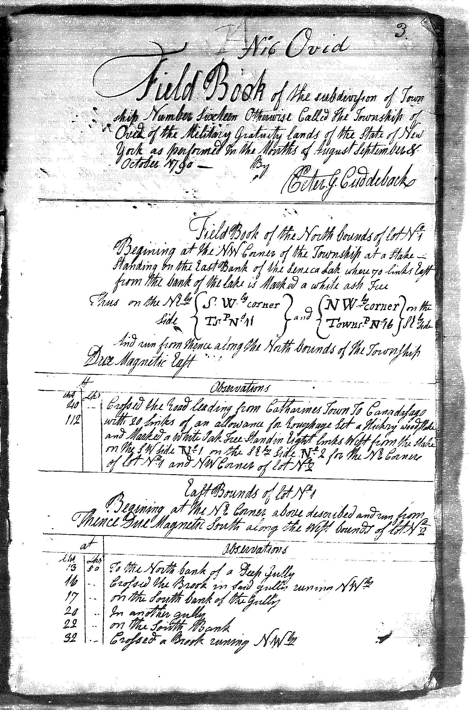

# No. 16 Ovid

Field Book of the subdivision of Township Number Sixteen Otherwise Called the Township of Ovid of the Military Gratuity lands of the State of New York as performed In the Months of Au-gust September & October 1790 -

By Peter G. Cuddeback

---

### Field Book of the North bounds of lot No. 1

Begining at the NW Corner of the Township at a Stake - Standing on the East Bank of the Seneca Lak where 70 links East from the bank of the lake is Marked a white ash Tree

Thus on the NEly Side SWly corner Ts'P N'd 11 and NWly corner Towns'p No. 16 on the SEly Side

And run from thence along the North bounds of the Township Due Magnetic East

| At |    | Observations |
| -- | -- | ------------ |
| Chs | Lks | |
| 40 | - | Crossed the road leading from Catharines Town to Canadasago |
| 112 | - | With 20 Links of an allowance for roughage Set a Hickry wood Stake and Marked a white Oak Tree Standin Eight links West from the Stake on the SW Side No. 1 on the SEly Side No. 2 for the NE Corner of lot No. 1 and NW Corner of lot No. 2 |

### East Bounds of lot No. 1

Begining at the NE Corner above described [1NE] and run from Thence Due Magnetic South along the West bounds of lot No. 2

| At |    | Observations |
| -- | -- | ------------ |
| Chs | Lks | |
| 13 | 50 | To the North bank of a Deep Gully |
| 16 | - | Crossed the Brook in Said gully runnig NWly |
| 17 | - | On the South bank of the Gully |
| 20 | - | In another gully |
| 22 | - | On the South Bank |
| 32 | - | Crossed a Brook runing NWly |

## Lot No. 1

### East bounds of lot No. 1 Continued

| At |    | Observations |
| -- | -- | ------------ |
| Chs | Lks | |
| 59 | - | With 50 links of an allowance for Rughage in measurements To a Stake Standing four links West East from a Black Oak Tree Marked on the N.E. side No. 2 on the NW Side No. 1  Soil on the North bounds of this lot is light Timbered with Black and white Oak and is Open woods Soil on the East Bounds from the N.E. Corner To where it Crossed the first gully is also light and open woods Timber as Said befor [Black and white Oak] from the Second Gully To the SE Corner of Said lot is good Timber Hard Maple linden Some black and white Oak |

### South bounds of lot No. 1

Begining at the last Mentioned Corner [1SE] and run from Thence Due Magnetic West

| At |    | Observations |
| -- | -- | ------------ |
| Chs | Lks | |
| 40 | - | Crossed the road that leads from Catharines Town To Canadasago |
| 90 | - | To the Bank of the Seneca lake To a Poplar Stake Standing on the South Bank of a Drye Brook 28 links NW from a white Pine Tree Marked on the N.E. Side No. 1 on the S.E. Side No. 7 - The land this line Passes through is Midling good Timber black and white Oak Hard Maple linden Hickory &c. |

### West Bounds of lot No. 1

Is Constituted by the Easterin Shore of Seneca lake from the SW Corner last above described [1SW] To the NW Corner of The Same described in p.1st [1NW]

## Lot No. 2

### Field Book of the North Bounds of lot No. 2

Begining at the NE Corner of Said lot at a Basswood Stake standing in the North bounds of the Town and 25 links West from a white Oak Tree

## Lot No. 2

### North Bounds of lot No. 2 Continued

| at | Observations |
|    | Tree Marked on the SEly side No. 3 on the SWly side No. 2 from Thence Due Magnetic West along the North bounds of the Town |

| At |    | Observations |
| -- | -- | ------------ |
| Chs | Lks | |
| 2 | - | The five Mile Tree in Measureing West along the North bounds of the Town from the Cayuga lak the land Desending Nly Prety good Timbered Chiefly with white and Black Oak |
| 42 | - | Entered low ground Timbered with Elm Hickry Maple Oak &c. |
| 82 | - | The Six Mile Tree |
| 85 | - | To a Brook with High Bank |
| 101 |- | To the NW Corner of this lot bfore described [1NE] |

### East Bounds of lot No. 2

Begining at a S.E.Corner at a Stake standing in the North bounds of lot No. 9 and 22 links West from a white Oak Tree Marked on the NW Side No. 2 and on the NE Side No. 3. Thence Duee Magnetic North along the West bounds of lot No. 3

| At |    | Observations |
| -- | -- | ------------ |
| Chs | Lks | |
| 24 | - | A Brook runing NWly Soil Midling good Timbered with Black |
| 24 | - | and white Oak. |
| 58 | 76 | To the N.E.Corner of This lot described in page 2 [2NE] and Three |

### South Bounds of lot No. 2

Begining at the SW Corner of Said lot described In Page 2 [1SE] Thence Due Magnetic East

| At |    | Observations |
| -- | -- | ------------ |
| Chs | Lks | |
| 29 | - | Entered a Swamp Cov’d with all kind of Timber |
| 39 | - | Out of the Swamp |
| 68 | - | A Brook runing NWly |
| 71 | - | Crossed Said Brook agin |
| 78 | - | Entered a Swamp Cov’d with Hard and Sof Maple Elm and a few Hemlock |
| 88 | - | Out of the Swamp |
| 101 | - | To the SE Corner of this lot described in this page last above [2SE] |

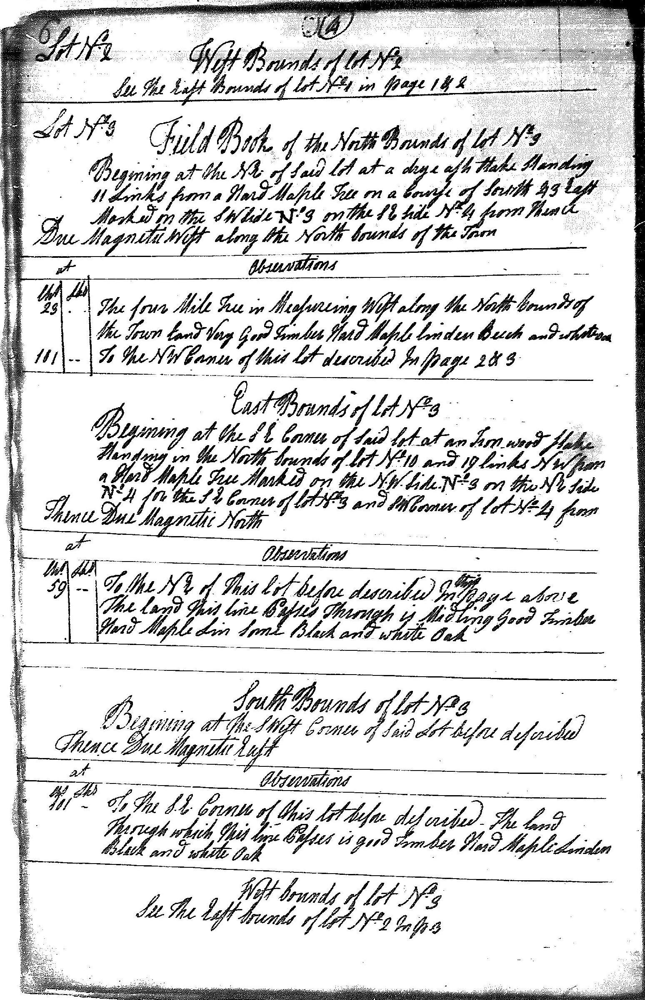

## Lot No. 2

### West Bounds of lot No. 2

See the East Bounds of lot No. 1 in page 1 & 2

## Lot No. 3

### Field Book of the North Bounds of lot No.3

Begining at the N.E. of Said lot at a drye ash Stake Standing 11 Links from a Hard Maple Tree on a Course of South 43 East Marked on the SW Side No. 3 on the SE side No. 4 from Thence Due Magnetic West along the North bounds of the Town

| at  |     | Observations |
| --- | --- | ------------ |
| Chs | Lks | |
| 23 | - | The four Mile Tree in Measureing West along the North bounds of the Town land Very Good Timber Hard Maple linden Beech and white oak |
| 101 | - | To the NW Corner of this lot described In page 2 & 3 [2NE] |

### East Bounds of lot No. 3

Begining at the SE Corner of Said lot at an Iron wood stake Standing in the North bounds of lot No. 10 and 19 links NW from a Hard Maple Tree Marked on the N.W. Side No. 3 on the NE side No. 4 for the SE Corner of lot No. 3 and the SW Corner of lot No. 4 from Thence Due Magnetic North

| at  |     | Observations |
| --- | --- | ------------ |
| Chs | Lks | |
| 59 | - | To the NE of this lot before described in this page above [3NE] The land this line Passes through is Midling Good Timber Hard Maple Lin Some Black and white Oak |

### South Bounds of lot No.3

Beginning at the SWest Corner of Said Lot before described [2SE] Thence Due Magnetic East.

| at  |     | Observations |
| --- | --- | ------------ |
| Chs | Lks | |
| 101 | - | To the S.E. Corner of this lot before described [3SE]- The land through which this line Passes is good Timber Hard Maple Linden Black and white Oak |

### West bounds of lot No. 3

See the East bounds of lot No. 2 In p 3

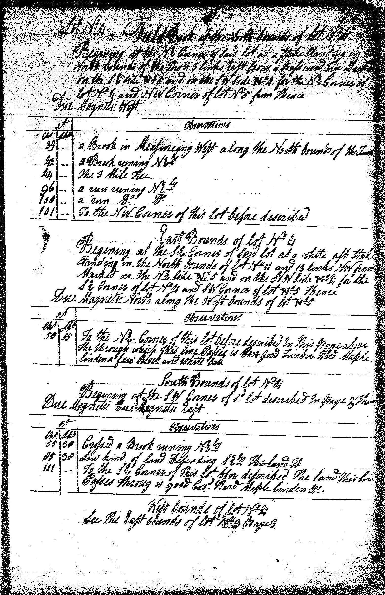

## Lot No. 4

### Field Book of the North bounds of lot No. 4

Begining at the NE Corner of Said lot at a Stake Standing in the North bounds of the Town 3 links East from a Bass wood Tree Marked on the SE Side No. 5 and on the SW Side No. 4 for the NE Corner of lot No. 4 and the NW Corner of lot No. 5 from Thence Due Magnetic West

| At |    | Observations |
| -- | -- | ------------ |
| Chs | Lks | |
| 39 | - | A Brook in Measuring West along the North bounds of the Town |
| 42 | - | A Brook runing NEly |
| 44 | - | The 3 Mile Tree |
| 96 | - | A run runing NEly |
| 100 | - | A run D’o [runing NEly ] |
| 101 | - | To the NW Corner of this lot before described [3NE] |

### East Bounds of lot No. 4

Begining at the S.E. Corner of Said lot at a white ash Stake Standing in the North bounds of lot No. 11 and 13 links NW from [?] Marked on the NE Side No. 5 and on the SW Side No. 4 for the SE corner of lot No. 4 and SW Corner of lot No. 5 thence Due Magnetic North along the West bounds of lot No. 5

| At |    | Observations |
| -- | -- | ------------ |
| Chs | Lks | |
| 50 | 55 | To the N.E.Corner of this lot before described In This Page above  [4NE] The [land?] through which this line Passes is Poor Good Timber Hard Maple linden a few Black and white Oak |

### South Bounds of lot No.4

Begining at the SW Corner of S’d lot described in page 3 [page 4] [3SE] Thence Due Magnetic Due Magnetic East

| At |    | Observations |
| -- | -- | ------------ |
| Chs | Lks | |
| 55 | 38 | Crossed a Brook runing NEly |
| 85 | 38 | Low kind of land Desending SEly The land |
| 101 | - | To the SE Corner of This lot bfore described The land This line Passes throug is good Cov’d Hard Maple linden &c. |

### West Bounds of lot No. 4

See the East bounds of lot No. 3 page 3 [page 4]

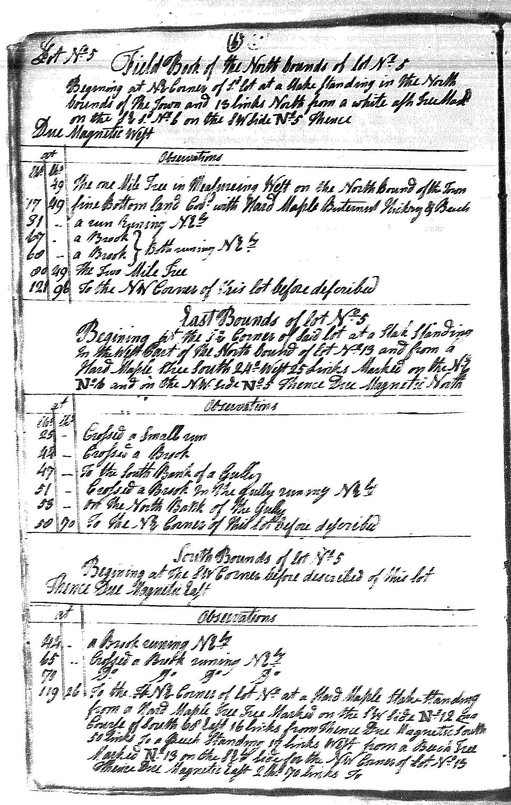

## Lot No. 5

### Field Book of the North bounds of lot No. 5

Begining at the NE Corner of S’d lot at a Stake Standing in the North bounds of the Town and 13 links North from a white ash Tree Mark’d on the SE s’d No. 6 on the SW Side No. 5 Thence Due Magnetic West

| At |    | Observations |
| -- | -- | ------------ |
| Chs | Lks | |
| - | 49 | The one Mile Tree Measureing West on the North bound of the Town |
| 17 | 49 | Fine Bottom land Cov’d with Hard Maple Butternut Hickry & Beech |
| 31 | - | A run Runing NEly |
| 67 | - | A Brook Both runing NEly |
| 68 | - | A Brook Both runing NEly |
| 80 | 49 | The Five Mile Tree |
| 121 | 96 | To the NW Corner of this lot before described [4NE] |

### East bounds of lot No. 5

Begining at the SE Corner of Said lot at a Stak Standing In the West Part of the North bound of lot No. 13 and from a Hard Maple tree South 24º West 25 Links Marked on the NE No.6 and on the NW side No. 5 Thence Due Magnetic North

| At |    | Observations |
| -- | -- | ------------ |
| Chs | Lks | |
| 25 | - | Crossed a Small run |
| 44 | - | Crossed a Brook |
| 47 | - | To the South Bank of a Gully |
| 51 | - | Crossed a Brook In the gully runing NEly |
| 53 | - | On the North Bank of the Gully |
| 58 | 70 | To the NE Corner of this lot before described [5NE] |

### South Bounds of lot No. 5

Begining at the SW Corner before described [4SE] of this lot Thence Due Magnetic East

| At |    | Observations |
| -- | -- | ------------ |
| Chs | Lks | |
| 44 | - | A Brook runing NEly |
| 65 | - | Crossed a Brook runing NEly |
| 70 | - | D’o [Crossed a brook runing NEly] |
| 119 | 26 | To the Th NE Corner of lot No. [12] at a Hard Maple Stake Standing from a Hard Maple Tree Tree Marked on the SW Side No. 12 on a Course of South 68 East 16 links from Thence Due Magnetic South 50 links To a Beech Standing 17 links West from a Beech Tree Marked No.13 on the SEly Side for the NW Corner of lot No. 13 Thence Due Magnetic East 2 Chs 70 links To |

## Lot No. 5

### Field Book of the South Bounds of lot No. 5 Continued

| At |    | Observations |
| -- | -- | ------------ |
| Chs | Lks | |
| - | - | To the S.E. Corner of this lot before described [5SE] The land This line Passes Through is good Timbered with Hard Maple Lin Some Beech a few Black and white Oak |

### West Bounds of lot No. 5

See the East bounds of lot No. 4 page 5

## Lot No. 6

### Field Book of the North Bounds of lot No. 6

Begining at the NE Corner of The Township at a Stake Standing on the West bank of the Cayuga lake 47 links from the water and 8 links North from a white Oak Tree Marked on the NWly Side \
SE Corner Towns’p No. 11 and NEly Corner Towns’p No.16 on the SWly Side \
And run from thence along the North bounds of the Township Due Magnetic West

| At |    | Observations |
| -- | -- | ------------ |
| Chs | Lks | |
| 18 | - | A brook with Very high Banks runing NEly Land Timbered with white and Black Oak Hard Maple Linden Hickry Elm & Butternut |
| 48 | - | & 50 Chs Spring runs |
| 60 | - | A Brook |
| 79 | 51 | To the NW Corner of This lot before described [5NE] |

### South Bounds of lot No. 6

Begining at the SW Corner of this lot before described [5SE] Thence Due Magnetic East

| At |    | Observations |
| -- | -- | ------------ |
| Chs | Lks | |
| 37 | - | To a Brook with Very High Banks runing NEly |
| 129 | 28 | To the Bank of the Cayuga lake To a white Pine Stake Standing on the bank of Said lake and from a Hemlock Tree Marked on the SWly side No. 13 and on the NWly side No. 6 for the S.E. Corner of lot No. 6 and NE Corner of lot No. 13 - 15 link South Soil good Timber Hard Maple Linden Black and white Oak Hickry. |

### East bounds of lot No. 6

Is Constituted by the Westerin Shore of the Cayuga lake from the SE Corner of Said lot To the NE Corner of the Same before described [6NE]

See the map

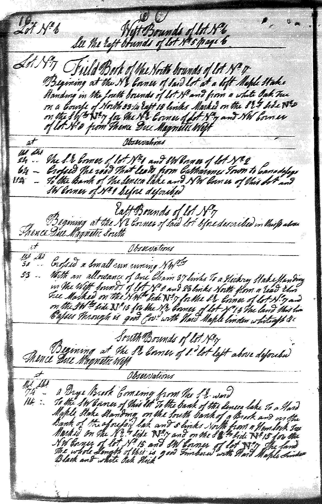

## Lot No. 6

### West Bounds of lot No. 6

See the East bounds of lot No. 5 page 6

## Lot No. 7

### Field Book of the North bounds of lot No. 7

Begining at the NE corner of Said lot at a Soft Maple Stake Standing in the South bounds of lot No. [1] and from a white Oak Tree on a Course of North 59·/4 East 15 links Marked on the SEly Side No. 8 on the SWly [side] No. 7 for the N.E. Corner of lot No. 7 and NW Corner of lot No. 8 from Thence Due Magnetic West

| At |    | Observations |
| -- | -- | ------------ |
| Chs | Lks | |
| 24 | - | The SE Corner of lot No. 1 and the SW Corner of lot No.2 |
| 64 | - | Crossed the road that leads from Catherines Town to Canadasago |
| 114 | - | To the Bank of the Seneca lake and NW Corner of this lot and SW Corner of No. 1 before described [1SW] |

### East bounds of lot No.7

Begining at the NE Corner of Said lot before described in this p above [7NE] Thence Due Magnetic South

| At |    | Observations |
| -- | -- | ------------ |
| Chs | Lks | |
| 30 | - | Crossed a Small run runing NWly |
| 53 | - | With an allowance of One Chain 37 links To a Hickry Stake standing in the West bounds of lot No.8 and 23 links North from a Read Elm Tree Marked on the NWly Side No. 7 for the S.E. Corner of lot No. 7 and on the SWly Side No. 15 for the NE Corner of lot No. 15 The land this line Passes through is good Cov’d with Hard Maple linden white ash &c |

### South Bounds of lot No.7

Begining at the SE Corner of S’d lot last above described [7SE] Thence Due Magnetic West

| At |    | Observations |
| -- | -- | ------------ |
| Chs | Lks | |
| 74 | - | A Drye Brook Comeing from the S.E.ward |
| 112 | - | To the SW Corner of this lot To the bank of the Seneca lake To a Hard Maple Stake Standing on the South bank of a Brook and on the Bank of the aforesaid lak and 5 links North from a Hemlock Tree Marked on the NEly Side No. 7 and on the SEly side No. 15 for the NW Corner of lot No. 15 and SW Corner of lot No. 7  The land the whole Length of this is good Timbered with Hard Maple Linden Black and white Oak Hick |

## Lot No. 7

### West Bounds of Lot No. 7

Is Constituted by the Easterin Shore of the Seneca Lak from the S West Corner of Said lot To the NW Corner of the Same Heretofore described [1SW]

## Lot No. 8

### Field Book of the North bounds of lot No. 8

Begining at a Stake Standing in the South bounds of lot at the NE Corner of lot No. 7 before described [7NE] thence Due Magnetic East

| At |    | Observations |
| -- | -- | ------------ |
| Chs | Lks | |
| 4 | - | Entered a Swamp Cov’d with all kind of Timber |
| 15 | - | Out of the Swamp |
| 44 | - | A Brook runing NWly |
| 47 | - | Crossed Said Brook again |
| 54 | - | Entered a Swamp Cov’d with Hard and Soft Maple Elm & a few Hemlock |
| 64 | - | Out of the Swamp |
| 81 | 46 | To the NE Corner of of this lot To a Hickry Stake Standing in the South bounds of lot No. 2 - 22 Links on a Course of North 18° East from a white Oak Tree Marked on the S.E. side No. 9 on the SW Side No. 8 for the NE Corner of lot No. 8 and NW Corner of lot No. 9 from [?] |

### East Bounds of lot No. 8

Begining at an Elm Stake Standing 16 links on a Cour of Course of South 37 West from a white Oak Tree Marked on the NW Side No. 8 for the Banks of lak  and on the N.E. Side No. 9 on the SW Side No. 17 on the SE Side No. 18 for the N.E. Corner of lot No. 17  NW Corner of lot No. 18 SE Corner of lot No. 8 and SW Corner of lot No. 9 from thence Due Magnetic North

| At |    | Observations |
| -- | -- | ------------ |
| Chs | Lks | |
| 75 | 95 | To the NE Corner of this lot before described [8NE] The land this line Passes through is Midling Good Timber Black and white Oak and opend woods |

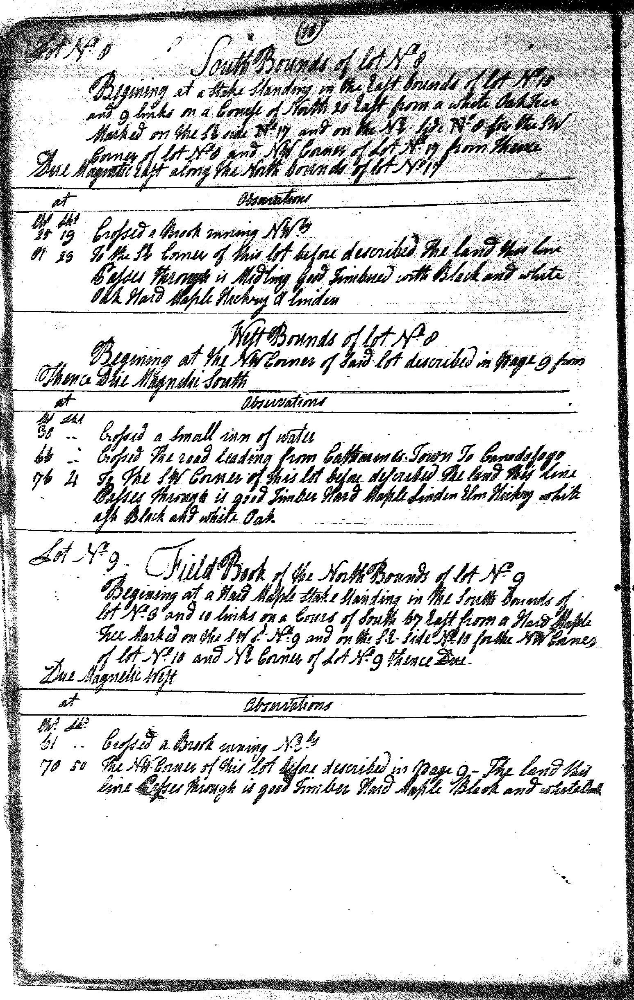

## Lot No. 8
### South Bounds of lot No. 8

Begining at a Stake Standing in the East bounds of lot No.15 and 9 links on a Course of North 20 East from a white Oak Tree Marked on the SE side No. 17 and on the N.E Side No. 8 for the SW Corner of lot No. 8 and NW Corner of lot No. 17 from Thence Due Magnetic East along the North bounds of lot No. 17

| At |    | Observations |
| -- | -- | ------------ |
| Chs | Lks | |
| 25 | 19 | Crossed a Brook runing NWly |
| 81 | 23 | To the SE Corner of this lot before described [8SE] The land this line Passes through is Midling Good Timbered with Black and white Oak Hard Maple Hickry & Linden |

### West Bounds of lot No. 8

Begining at the NW Corner of Said lot described in page 9 [page 8] [7NE] from Thence Due Magnetic South

| At |    | Observations |
| -- | -- | ------------ |
| Chs | Lks | |
| 30 | - | Crossed a Small run of water |
| 66 | - | Crossed The road leading from Catherines Town To Canadasago |
| 76 | 4 | To the SW Corner of this lot before described [8SW] The land this line Passes through is good Timber Hard Maple Linden Elm Hickry white ash Black and white Oak |

## Lot No. 9

### Field Book of the North Bounds of lot No. 9

Begining at a Hard Maple Stake Standing in the South Bounds of lot No. 3 and 10 links on a Cours of South 67 East from a Hard Maple Tree Marked on the SW s’d No. 9 and on the S.E. Side No. 10 for the NW Corner of lot No. 10 and the NE Corner of lot No. 9 thence Due Due Magnetic West

| At |    | Observations |
| -- | -- | ------------ |
| Chs | Lks | |
| 61 | - | Crossed a Brook runing NEly |
| 70 | 50 | The N.W. Corner of this lot before described in page 9 [8NE] The land this line Passes through is good Timber Hard Maple Black and white Oak |

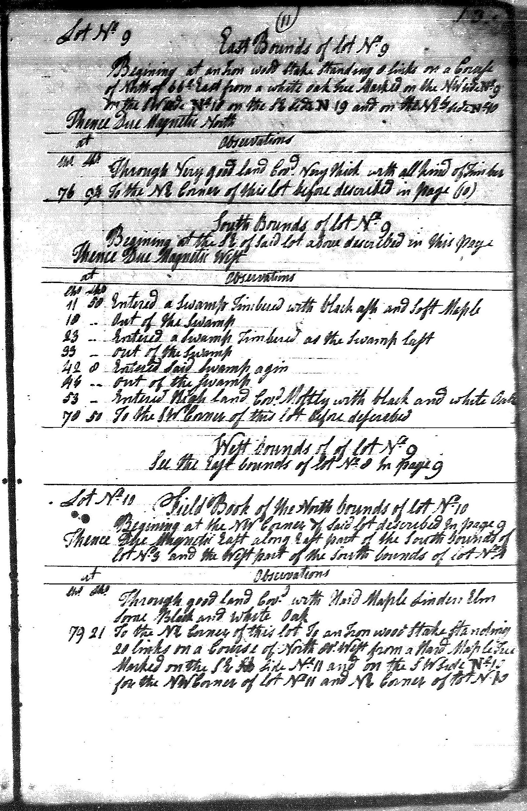

## Lot No. 9

### East Bounds of lot No. 9

Begining at an Iron wood Stake Standing 8 links on a Course of North of 66º East from a white oak Tree Marked on the NW side No. 9 on the SW side No. 18 on the SE side No. 19 and on the NEly side No. 10 Thence Due Magnetic North

| At |    | Observations |
| -- | -- | ------------ |
| Chs | Lks | |
| - | - | Through Very good land Cov’d very thick with all kinds of timber To the NE Corner |
| 76 | 94 | of this lot before described in page (10) [9NE] |

### South Bounds of lot No. 9

Begining at the SE of Said lot above described in this page [9SE] Thence Due Magnetic West

| At |    | Observations |
| -- | -- | ------------ |
| Chs | Lks | |
| 11 | 50 | Entered a Swamp Timbered with black ash and Soft Maple |
| 18 | - | Out of the Swamp |
| 23 | - | Entered a Swamp timbered as the Swamp left |
| 33 | - | Out of the Swamp |
| 42 | 8 | Entered Said Swamp agin |
| 46 | - | Out of the Swamp |
| 53 | - | Entered High land Cov’d Mostly with black and white Oak |
| 78 | 50 | To the SW Corner of this lot before described [8SE] |

### West bounds of of lot No. 9

See the East bounds of lot No. 8 In page 9

## Lot No. 10

### Field Book of the North bounds of lot No. 10

Begining at the NW Corner of Said lot described In page 9 [page 10] Thence Due Magnetic East along East part of the South bounds of lot No. 3 and the West part of the South bounds of lot No. 4

| At |    | Observations |
| -- | -- | ------------ |
| Chs | Lks | |
| - | - | Through good land Cov’d with Hard Maple Linden Elm Some  Black and White Oak |
| 79 | 21 | To the NE Corner of this lot To an Iron wood Stake Standing 20 links on a Course of North 80º West from a Hard Maple Tree Marked on the S.E. Side No. 11 and on the SW Side No. 10 for the NW Corner of lot No. 11 and NE Corner of lot No. 10 |

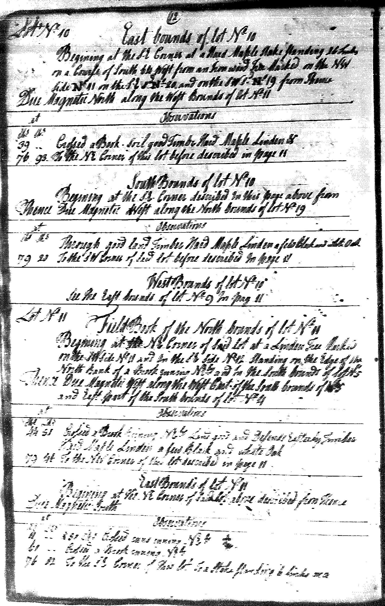

## Lot No. 10
### East bounds of lot No. 10

Begining at the SE Corner at a Hard Maple Stake standing 26 Links on a Course of South 64 West from an Iron wood Tree Marked on the NW Side No. 11 on the S.E. s’d No. 20 and on the SW s’d No. 19 from Thence Due Magnetic North along the West Bounds of lot No. 11

| At |    | Observations |
| -- | -- | ------------ |
| Chs | Lks | |
| 39 | - | Crossed a Brook - Soil good Timber Hard Maple Linden &c |
| 76 | 93 | To the NE Corner of this lot before described in page 11 [10NE] |

### South Bounds of lot No. 10

Begining at the S.E. Corner described In this page above [10SE] from Thence Due Magnetic West along the North bounds of lot No. 19

| At |    | Observations |
| -- | -- | ------------ |
| Chs | Lks | |
| - | - | Through good land Timber Hard Maple Linden a few Black and white Oak |
| 79 | 20 | To the SW Corner of Said lot before described In page 11 [9SE] |

### West Bounds of lot No. 10

See the East bounds of lot No. 9 In pag 11

## Lot No. 11

### Field Book of the North bounds of lot No. 11

Begining at the NE corner of Said lot at a Linden Tree Marked on the SW Side No. 11 and on the SE Side No. 12 Standing on the Edge of the North Bank of a Brook runing NEly and In the South bounds of lot No. 5 Thence Due Magnetic West along the West Part of the South bounds of No. 5 and East part of the South bounds of lot No. 4

| At |    | Observations |
| -- | -- | ------------ |
| Chs | Lks | |
| 44 | 31 | Crossed a Brook runing NEly Land good and Desends Easterly Timber Hard Maple Linden a few Black and white Oak |
| 79 | 46 | To the NW Corner of the lot described in page 11 [10NE] |

### East Bounds of lot No. 11

Begining at the NE Corner of Said lot above described [11NE] from Thence Due Magnetic South

| At |    | Observations |
| -- | -- | ------------ |
| Chs | Lks | |
| 11 | - | & 30 Crossed runs runing NEly |
| 30 | - | Crossed runs runing NEly |
| 61 | - | Crossed a Brook runing NEly |
| 76 | 82 | To the SE Corner of this lot To a Stake standing 6 links in a |

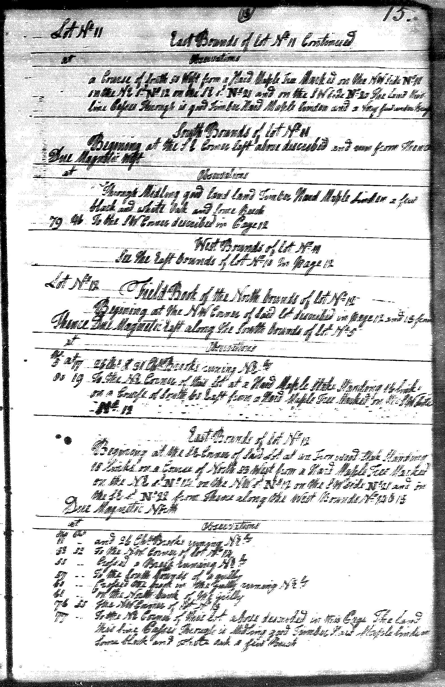

## Lot No. 11

### East Bounds of lot No. 11 Continued

| At |    | Observations |
| -- | -- | ------------ |
| Chs | Lks | |
| - | - | A Course of South 50 West from a Hard Maple Tree Marked on the NW Side No. 11 on the NE s’d No. 12 on the SE s’d No. 21 and on the SW Side No. 20 The land this line Passes through is good Timber Hard Maple linden and a very few underbrush |

### South Bounds of lot No. 11

Begining at the SE Corner last above described [11SE] and run from Thence Due Magnetic West

| At |    | Observations |
| -- | -- | ------------ |
| Chs | Lks | |
| - | - | Through Midling good land land Timber Hard Maple Linden a few black and white Oak and Some Beech |
| 79 | 46 | To the SW Corner described in Page 12 [10SE] |

### West Bounds of lot No. 11

See the East bounds of lot No. 10 In page 12

## Lot No. 12

### Field Book of the North bounds of lot No. 12

Begining at the NW Corner of Said lot described in page 12 and 13 [11NE] from Thence Due Magnetic East along the South bounds of lot No. 5

| At |    | Observations |
| -- | -- | ------------ |
| Chs | Lks | |
| 5 | 17 | 26 Chs & 31 Chs Brook runing NEly |
| 80 | 19 | To the NE Corner of this lot at a Hard Maple Stake Standing 16 links on a Course of South 60 East from a Hard Maple Tree Marked on the SW Side Lot No. 12 |

### East Bounds of lot No. 12

Begining at the S.E. Corner of Said Lot at an Iron wood Stake Standing 18 links on a Course of North 53 West from a Hard Maple Tree Marked on the NE s’d No. 14 on the NW s’d No. 12 on the SW side No. 21 and in SE s’d No. 22 from Thence along the West Bounds No. 14 & 13 Due Magnetic North

| At |    | Observations |
| -- | -- | ------------ |
| Chs | Lks | |
| 11 | - | And 26 Chs Brook runing NEly |
| 38 | 52 | To the N.W. Corner of lot No. 14 |
| 50 | - | Crossed a Brook runing NEly |
| 57 | - | To the South Bounds of a gully |
| 60 | - | Crossed the brook in the gully runing NEly |
| 61 | - | On the North bank of the Gully |
| 76 | 55 | The NW Corner of lot No. 13 |
| 77 | - | To the NE Corner of this lot above described in this Page [12NE] The land this line Passes Through is Midling good Timber Hard Maple linden Some black and white oak a few Bush |

## Lot No. 12

### South Bounds of lot No. 12

Begining at the SE Corner of Said lot described in page 13 [12SE] Thence Due Magnetic West along the the North bounds of lot No. 21

| At |    | Observations |
| -- | -- | ------------ |
| Chs | Lks | |
| 36 | 96 | A Drye Brook |
| 80 | - | A Brook runing NEly |
| 80 | 96 | To the SW Corner of this lot described in Page 13 [11SE] The land this line Passes Through is good Timber Hard Maple Linden a few black and white Oak |

### West Bounds of lot No. 12

See the East bounds of lot No. 11 In page 12 & 13

## Lot No. 13

### Field Book of the North bounds of lot No. 13

See the Field Book of the South bounds of of lot No. 6 page 7

### South Bounds of lot No. 13

Begining at the SE Corner of Said lot at a Hard Maple Stake Standing 10 links West from a Black Oak Tree Marked on the NW side No. 13 from Thence Due Magnetic West along the North bounds of lot No. 14

| At |    | Observations |
| -- | -- | ------------ |
| Chs | Lks | |
| 40 | 94 | On the East bank of a gully |
| 42 | - | Crossed a Brook in the Gully runing NEly |
| 43 | - | On the West Bank of the Gully |
| 156 | 50 | To the SW Corner of this lot To a Stake Standing in the East bounds of lot No. 12 and 9 Links on a Course of South 17º West from a Hard Maple Tree Marked on the N.E. Side 13 and on the S.E.Side No. 14 for the NW Corner of Lot No. 14 and the SW Corner of lot No. 13 |

### West Bounds of Lot No. 13

Begining at the SW Corner of Said lot last above described [13SW] from Thence along the North Part of the East Bounds of lot No. 12—Due Magnetic North

| At |    | Observations |
| -- | -- | ------------ |
| Chs | Lks | |
| 42 | 90 | To a the NW Corner of this lot To a Beech Stake Standing in the East bounds of lot No. 12 and 50 Links from the NE Corner of lot No. 12 also 17 links West from a Beech Tree Marked on the |

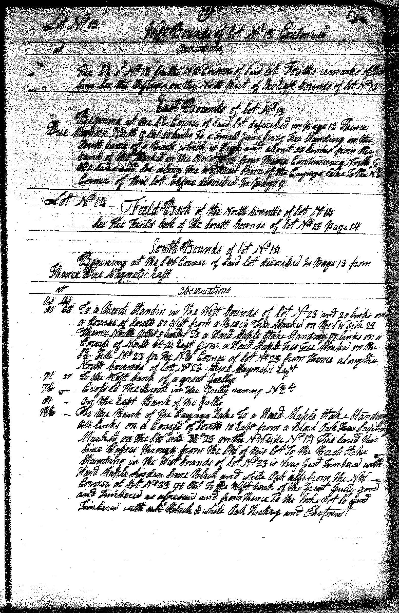

## Lot No. 13

### West Bounds of lot No. 13 Continued

| At |    | Observations |
| -- | -- | ------------ |
| - | - | The SE s’d No. 13 for the NW corner of Said lot For the remarks of this line See the Distance on the North part of the East bounds of lot No. 12 |

### East Bounds of lot No.13

Begining at the S.E. Corner of Said lot described in page 12 [page 14][13SE] Thence Due Magnetic North 7 Chs 50 links To a Small Juneberry Tree Standing on the South bank of a Brook which is High and about 50 links from the bank of [Cayuga Lake] Marked on the NW S’d No. 13 from Thence Continuing North To the lake and [?] along the Westerin Shore of the Cayuga lake To the NE Corner of this lot before described In page 7 [6SE]

## Lot No. 14

### Field Book of the North bounds of lot No. 14

See the Field book of the South bounds of lot No. 13 page 14

### South Bounds of lot No. 14

Begining at the SW Corner of Said lot described In page 13 [12SE] from Thence Due Magnetic East

| At |    | Observations |
| -- | -- | ------------ |
| Chs | Lks | |
| 80 | 63 | To a Beech Standin in the West bounds of lot No. 23 and 20 links on a Course of South 50 West from a Beech Tree Marked on the SW side 22 Thence North 4 Chs 5 links To a Hard Maple Stake Standing 17 links on a Course of North 61·/4 East from a Hard Maple Tree Tree Marked on the S.E. Side No. 23 for the NE Corner of lot No. 23 from Thence along the North bounds of lot No. 23 Due Magnetic East |
| 71 | 17 | [Started at 0 chains from the corner tree above] To the West bank of a great Gully |
| 76 | - | Crossed the Brook in the Gully runing NEly |
| 81 | - | On the East Bank of the Gully |
| 116 | - | To the Bank of the Cayuga lake To a Hard Maple Stake Standing  44 links on a Course of South 10 East from a Black Oak Tree Sapling Marked on the SW side No. 23 on the NW side No. 14 The land this line Passes Through from the SW of this lot To the Beech Stake Standing in the West bounds of lot No. 23 is Very Good Timbered with Hard Maple To the West bank of the Great Gully good and Timbered as aforesaid and from Thence to the lake Not So good Timbered with all Black and white Oak Hickry and Chisnut |

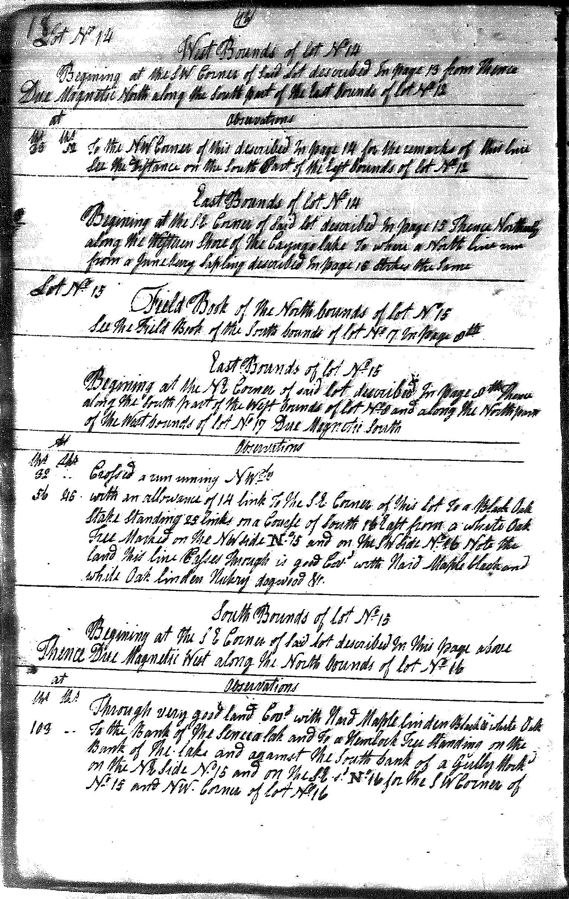

## Lot No. 14
### West Bounds of lot No. 14

Begining at the SW Corner of Said lot described In page 13 [12SE] from Thence Due Magnetic North along the South part of the East bounds of lot No. 12

| At |    | Observations |
| -- | -- | ------------ |
| Chs | Lks | |
| 38 | 52 | To the NW Corner of this described In page 14 [13SW] for the remarks of this line See the Distance on the South Part of the East bounds of lot No. 12 |

East Bounds of lot No. 14
Begining at the S.E. Corner of Said lot described In page 15 [14SE] Thence Northerly along the Westerin Shore of the Cayuga lake To where a North line runs from a Juneberry Sapling described In page 15 [13SE] Stakes the Same

## Lot No. 15
### Field Book of the North bounds of lot No. 15

See the Field Book of the South bounds of lot No. 7 In page 8th

### East Bounds of lot No. 15

Begining at the NE Corner of said lot described In page 8th [7SE] Thence along the South Part of West bounds of lot No. 8 and along the North part of the West bounds of lot No. 17 Due Magnetic South

| At |    | Observations |
| -- | -- | ------------ |
| Chs | Lks | |
| 32 | - | Crossed a run runing NWly |
| 56 | 45 | With an allowance of 14 link To the S.E.Corner of this lot To a Black Oak Stake Standing 25 links on a Course of South 16 East from a white Oak Tree Marked on the NW Side No. 15 and on the SW Side No. 16 Note the land this line Passes Through is good Cov’d with Hard Maple black and white Oak linden Hickry dogwood &c. |

### South Bounds of lot No. 15

Begining at the SE Corner of Said lot described In this page above [15SE] Thence Due Magnetic West along the North bounds of lot No. 16

| At |    | Observations |
| -- | -- | ------------ |
| Chs | Lks | |
| - | - | Through very good land Cov’d with Hard Maple linden Black & white Oak |
| 103 | - | To the Bank of the Seneca lak and To a Hemlock Tree Standing on the Bank of the lake and against the South bank of a Gully Mark’d on The NE Side No. 15 and on the S.E. s’d No. 16 For The SW Corner of No. 15 and the NW Corner of lot No. 16 |

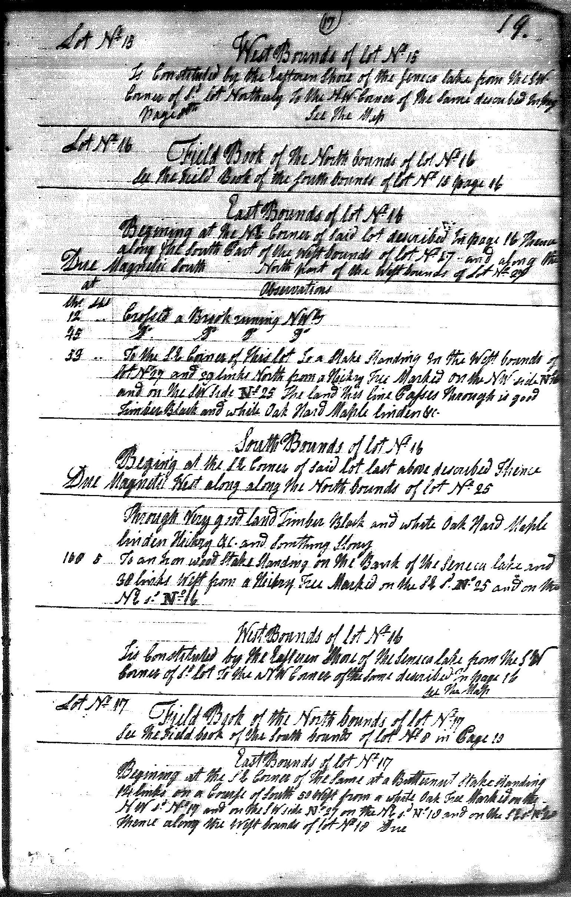

## Lot No. 15
### West Bounds of lot No.15

Is Constituted by the Easteren Shore of the Seneca lake from the SW Corner of S’d lot Northerly to the N.W. Corner of the Same described In the page 8th [7SW] See the Map

## Lot No. 16
### Field Book of the North bounds of lot No. 16

See the Field Book of the south bounds of Lot No. 15 Page 16

### East Bounds of lot No. 16

Begining at the NE Corner of Said lot described In Page 16 [15SE]  Thence along the South Part of the West bounds of lot No. 17 and along the North Part of the West bounds of Lot No. 27 Due Magnetic South

| At |    | Observations |
| -- | -- | ------------ |
| Chs | Lks | |
| 12 | - | Crossed a Brook runing NWly |
| 45 | - | D’o | [Crossed a Brook runing NWly] |
| 53 | - | To the S.E.Corner of this lot To a Stake Standing In the West bounds of lot No. 27 and 29 links North from a Hickry Tree Marked on the NW side No. 16 and on the SW Side No. 25 The land this line Passes Through is good Timber Black and white Oak Hard Maple linden &c. |

### South Bounds of lot No. 16

Begining at the SE Corner of said lot last above described [16SE] Thence Due Magnetic West along along the North bounds of lot No. 25

| [At] |    | [Observations] |
| -- | -- | ------------ |
| [Chs] | [Lks] | |
| - | - | Through Very good land Timber Black and white Oak Hard Maple linden Hickry &c. and Something Stony |
| 108 | 5 | To an Iron wood Stake Standing on the Bank of the Seneca lake and 38 links West from a | Hickry Tree Marked on the SE s’d No. 25 and on the NE s’d No. 16 |

### West Bounds of lot No. 16

Tis Constituted by The Easteren Shore of the Seneca lake from the SW Corner of S’d lot To the NW Corner of the Same described In Page 16 [15SW]

See the Map

## Lot No, 17

### Field Book of the North bounds of lot No. 17

See the Field book of the South bounds of lot No. 8 in Page 10

### East Bounds of lot No. 17

Begining at the SE Corner of The Same at a Butternut Stake Standing 14 links on a Course of South 50 West from a white Oak Tree Marked on the NW s’d No. 17 and on the SW side No. 27 on the NE s’d No. 18 and The SE s’d No.28 Thence along the West bounds of lot No. 18 Due

## Lot No. 17

### East Bounds Continued

Due Magnetic North

| At |    | Observations |
| -- | -- | ------------ |
| Chs | Lks | |
| 57 | - | A Brook runing NWly Timber Black and white Oak Hickry Some Hard Maple |
| 77 | 92 | To the NE Corner of Said lot described in Page 10 [8SE] |

### South Bounds of lot No. 17

Begining at the SE Corner of the Same described In page 17 [17SE] from Thence Due Magnetic West along the North [South] bounds of lot No. 17

| At |    | Observations |
| -- | -- | ------------ |
| Chs | Lks | |
| - | - | Through good land for 36 chains Cov’d with Hard Maple linden a few Black and white Oak Some black walnut Then Entered Oak woods |
| 69 | - | Crossed Catharines Town Road |
| 81 | - | To the SW Corner of this lot To a dogwood Stake Standing In the East bounds of lot No. 16 and 20 links on a Course of North 64 East from a white Oak Tree Marked Marked on The SE Side No. 27 and on the NE 17 |

### West Bounds of lot No. 17

Begining at the NW Corner of Said lot described in page 8th [page 10] [8SW] from Thence along the the South Part of the East bounds of lot No. 15 and also along the North Part of the East bounds of lot No. 16 Due Magnetic South

| At |    | Observations |
| -- | -- | ------------ |
| Chs | Lks | |
| 10 | - | Crossed a run runing Northwesterly |
| 46 | - | Crossed a run runing Northwesterly |
| 77 | 26 | To the N SW Corner of this lot described in this page above [17SW] |

## Lot No. 18

### Field Book of the North bounds of lot No. 18

See the Field Book of the North South bounds of lot No. 9 in p. 11

### East bounds of lot No. 18

Begining at the NE Corner described In Page 11 [9SE] from Thence along Due Magnetic South along the West bounds of lot No. 19

| At |    | Observations |
| -- | -- | ------------ |
| Chs | Lks | |
| - | - | Through good land Cov’d Very thick with all kind of Timber |
| 77 | 62 | To the S.E. Corner of This lot To a Hickry Stake Standing 13 links North from a Black ash Tree Marked on the NW s’d No. 18 on the SW side No. 28 on the SE s’d No. 29 and on the NE Side No. 19 |

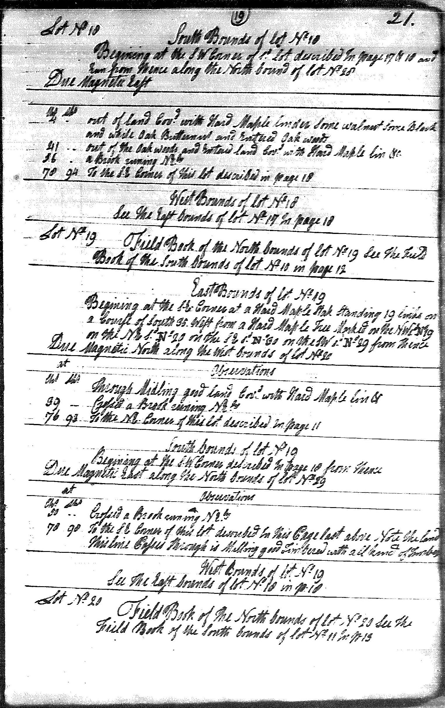

## Lot No. 18

### South Bounds of lot No. 18

Begining at the SW Corner of s’d lot described In page 17 & 18 [17SE] and run from Thence along the North bound of lot No. 28 Due Magnetic East

|    |    |   |
| -- | -- | -- |
| Chs | Lks | |
| 4 | - | Out of land covered with Hard Maple Linden Some walnut Some Black and white Oak Butternut and Entered Oak woods |
| 41 | - | Out of The Oak woods and entered land Covered with Hard Maple lin &c |
| 56 | - | A Brook runing NEly |
| 70 | 94 | To the SE Corner of this lot described in Page 18 [18SE] |

### West Bounds of lot No. 18

See the East bounds of lot No. 17 in page 18

## Lot No. 19

### Field Book of the North bounds of lot No. 19.

See the Field Book of the South bounds of lot No. 10 in page 12

### East Bounds of lot No. 19

Begining at the SE Corner at a Hard Maple Stake Standing 19 links on a Course of South 35 West from a Hard Maple Tree Marked on the NW s’d No. 19 on the NE s’d No. 20 on the SE s’d No. 30 on the SW s’d No. 29 from Thence Due Magnetic North along the West bounds of lot No. 20

| At |    | Observations |
| -- | -- | ------------ |
| Chs | Lks | |
| - | - | Through Midling good land Cov’d with Hard Maple lin &c |
| 39 | - | Crossed a Brook runing NEly |
| 76 | 93 | To the NE Corner of this lot described In Page 11 [Page 12] [10SE] |

### South bounds of lot No. 19

Begining at the SW Corner described In Page 18 [18SE] from Thence Due Magnetic East along the North bounds of lot No. 29

| At |    | Observations |
| -- | -- | ------------ |
| Chs | Lks | |
| 50 | - | Crossed a Brook runing NEly |
| 78 | 98 | To the SE Corner of this lot described In this Page last above [19SE] Note the land this line | Passes Through is Midling good timbered with all kind of Timber |

### West Bounds of lot No. 19

See the East Bound of lot No. 18 in p. 18

## Lot No. 20

### Field Book of the North bounds of lot No. 20

See the Field Book of the South bounds of lot No. 11 in p 13

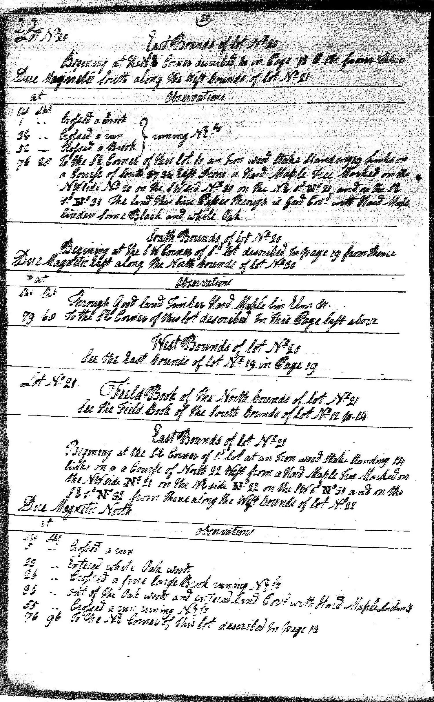

## Lot No. 20

### East Bounds of lot No. 20

Begining at the NE Corner described In in Page 12 & 13 [11 SE] from Thence Due Magnetic South along the West bounds of lot No. 21

| At |    | Observations |
| -- | -- | ------------ |
| Chs | Lks | |
| 1 | - | Crossed a Brook runing NEly |
| 36 | - | Crossed a run runing NEly |
| 52 | - | Crossed a Brook runing NEly |
| 76 | 28 | To the SE Corner of this lot to an Iron wood Stake Standing 19 links on a Course of South 37 3/4 East From a Hard Maple Tree Marked on the NW Side No. 20 on the SW Sid No. 30 on the NE s’d No. 21 and on the SE s’d No. 31 The land this line Passes through is Good Cov’d with Hard Maple linden Some Black and white Oak |

### South Bounds of lot No. 20

Begining at the SW Corner of S’d lot described In page 19 [19SE] from Thence Due Magnetic East along the North bounds of lot No. 30

| At |    | Observations |
| -- | -- | ------------ |
| Chs | Lks | |
| - | - | Through Good land Timber Hard Maple lin Elm &c. |
| 79 | 68 | To the SE Corner of this lot described in This Page last above [20SE] |

### West Bounds of lot No. 20

See the East bounds of lot No. 19 in Page 19

## Lot No. 21

### Field Book of the North bounds of lot No. 21

See the Field Book of the South bounds of lot No. 12 p. 14

### East Bounds of lot No. 21

Begining at the S.E. Corner of S’d lot at an Iron wood Stake Standing 14 links on a Course of North 22 West from a Hard Maple Tree Marked on the NW side No. 21 on the NE side No. 22 on the SW S’d No. 31 and on the SE s’d No. 32 from Thence along the West bounds of lot No. 22 Due Magnetic North

| At |    | Observations |
| -- | -- | ------------ |
| Chs | Lks | |
| 5 | - | Crossed a run |
| 23 | - | Entered white Oak woods|
| 26 | - | Crossed a fine large Brook runing NEly |
| 36 | - | Out of the Oak woods and entered land Cov’d with Hard Maple linden &c |
| 55 | - | Crossed a run runing NEly |
| 76 | 96 | To the NE Corner of this lot described in page 13 [12SE] |

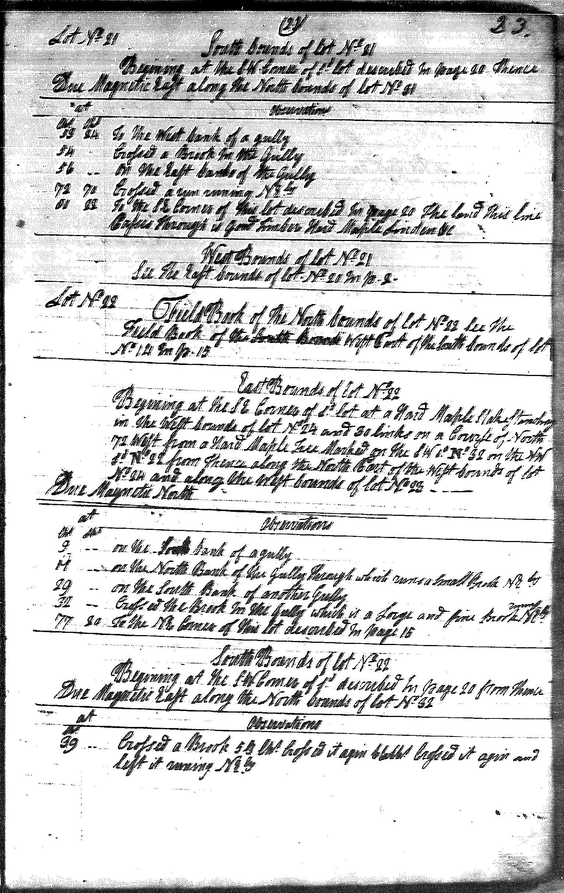

## Lot No. 21

### South bounds of lot No. 21

Begining at the S.W. Corner of S’d lot described in page 20 [20SE] Thence Due Magnetic East along the North bounds of lot No. 31

| At |    | Observations |
| -- | -- | ------------ |
| Chs | Lks | |
| 53 | 24 | To the West bank of a gully |
| 54 | - | Crossed Brook In the Gully |
| 56 | - | On the East bank of the Gully |
| 72 | 70 | Crossed a run runing NEly |
|80 | 22 | To the SE Corner of this lot described In page 20 [21SE] The land This line Passes through is Good Timber Hard Maple Linden &c |

### West Bounds of lot No. 21

See the East bounds of lot No. 20 in p. 20

## Lot No. 22

### Field Book of the North bounds of lot No. 22

See the Field Book of the South Bounds West part of the South bounds of lot No. 14 in p. 15

### East Bounds of lot No. 22

Begining at the SE Corner of S’d lot at a Hard Maple Stake Standing in the West bounds of lot No. 24 and 30 links on a Course of North 72 West from a Hard Maple Tree Marked on the SW s’d No. 32 on the NW s’d  No. 22 from Thence along the North Part of the West bounds of lot No. 24 and along the West bounds of lot No. 23 Due Magnetic North

| At |    | Observations |
| -- | -- | ------------ |
| Chs | Lks | |
| 9 | - | On the South bank of a gully |
| 11 | - | On the North Bank of the Gully through which runs a Small Brook NEly |
| 29 | - | On the South Bank of another Gully |
| 32 | - | Crossed the Brook in the Gully which is a Large and fine brook runing NEly |
| 77 | 90 | To the NE Corner of this lot described in page 15 [Lot No. 14 – 80 chains 63 links Observation] |

### South Bounds of lot No. 22

Begining at the S.W. Corner of s’d described In page 20 [21SE] from thence Due Magnetic East along the North bounds of lot No. 32

| At |    | Observations |
| -- | -- | ------------ |
| Chs | Lks | |
| 39 | - | Crossed a Brook 53 Chs. Crossed it agin 66 Chs Crossed it agin and left it | runing NEly  |

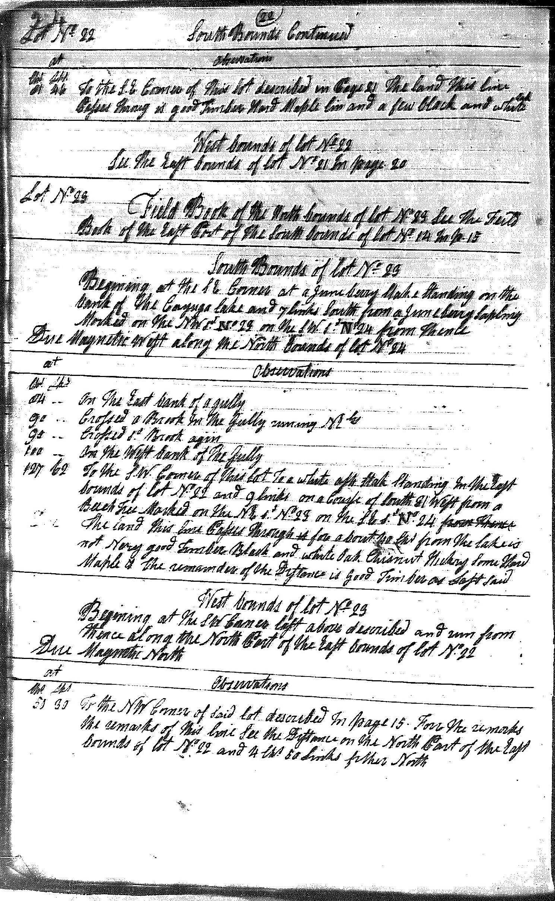

## Lot No. 22

### South Bounds Continued

| At |    | Observations |
| -- | -- | ------------ |
| Chs | Lks | |
| 81 | 46 | To the S.E.Corner of this lot described in Page 21 [22SE] The land this line Passes throug is good Timber Hard Maple lin and a few black and white oak  |

West bounds of lot No. 22
See the East bounds of lot No. 21 In page 20

## Lot No. 23

### Field Book of the North bounds of lot No. 23

See the Field Book of the East Part of the South bounds of lot No. 14 In p. 15

### South Bounds of lot No. 23

Begining at the SE Corner at a Juneberry Stake Standing on the bank of the Cayuga lake and 7 links South from a Juneberry Sapling Marked on the NW s’d No. 23 on the SW s’d No. 24 from thence Due Magnetic West along the North bounds of lot No. 24

| At |    | Observations |
| -- | -- | ------------ |
| Chs | Lks | |
| 84 | - | On the East bank of a gully |
| 90 | - | Crossed a Brook in the Gully runing NEly |
| 95 | - | Crossed S’d Brook agin |
| 100 | - | On the West bank of the Gully |
| 127 | 62 | To the S.W. Corner of this lot to a white ash Stak Standing In the East bounds of lot No. 22 and 9 links on a Course of South 81 West from a Beech Tree Marked on the NE s’d No. 23 on the SE s’d No. 24 from thence  The land this line Passes Through is for about 40 chs from the lake is not very good Timber Black and white Oak Chisnut Hickry Some Hard Maple & the remainder of the Distance is good Timber as Last Said |

### West Bounds of Lot No. 23

Begining at the SW Corner last above described [23SW] and run from thence along the North Part of the East bounds of lot No. 22 Due Magnetic North

| At |    | Observations |
| -- | -- | ------------ |
| Chs | Lks | |
| 50 | 30 | To the NW Corner of said lot described in page 15 [Lot No. 23 – 80 chains 63 links observation]. For the remarks the remarks of this line See the Distance on the North Part of the East bounds of lot No. 22 and 4 Chs 50 links further North |

## Lot No. 23

### East Bounds of lot No. 23

Is Constituted by the Westeren Shore of the Cayuga lake from the S.E. Corner of said lot described in Page 22 [23SE] To the N.E. Corner of the Same described in page 15 [14SE] (see the map)

## Lot No. 24
### Field Book of the North bounds of lot No. 24

See the Field book of the South bounds of lot No. 23 In p. 22

### South Bounds of lot No. 24

Begining at the S.E. [SW] Corner of S’d lot at a Hard Maple Stake standing In the East bounds of lot No. 32 and 10 links on a Course of South 43 West from a Hard Maple Tree Marked on the NE Side No. 24 on the S.E. s’d No. 33 Thence Due Magnetic East along the North bounds of lot No. 33

| At |    | Observations |
| -- | -- | ------------ |
| Chs | Lks | |
| 54 | - | A Brook runing NEly |
| 115 | - | On the West bank of a Gully |
| 121 | - | Crossed a Brook In the The Gully runing NEly |
| 132 | 69 | Down the Gully To the bank of the Cayuga lake to an Elm stake Standing 7 links South from a Beech Tree Marked on the SW s’d No. 33 on the NW s’d No. 24 for the S.E. Corner of lot No. 24 and NE Corner of lot No. 33 The land this line Passes through is good Timber Hard Maple linden Some Beech and a few Hemlock |

### West Bounds of lot No. 24

Begining at the SW Corner of S’d lot above described in this page [24SW] from Thence along the North part of the East bounds of lot No. 32 and along the South part of the East bounds of lot No. 22 Due Magnetic North.

| At |    | Observations |
| -- | -- | ------------ |
| Chs | Lks | |
| 46 | 66 | With an allowance of 50 links To the NW Corner of this lot described in Page 22 [23SW] for the remarks of this line See the distance on the North Part of the East bounds of lot No. 32 and on the South part of the East bounds of lot No. 22 |

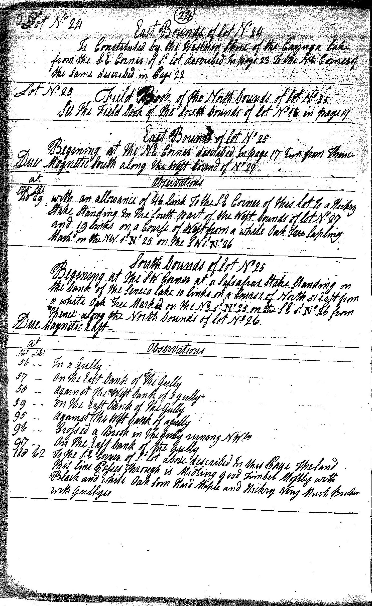

## Lot No. 24

### East Bounds of lot No. 24

Is Constituted by the Westerin Shore of the Cayuga lake from the S.E. Corner of S’d lot described In page 23 [24SE] To the NE Corner of the Same described in Page 22 [23SE]

## Lot No. 25

### Field Book of the North bounds of lot No. 25

See the Field book of the South bounds of lot No. 16 in page 17

### East Bounds of lot No. 25

Begining at the N.E. Corner described In page 17 [16SE] Run from thence Due Magnetic South along the West bound of No. 27

| At |    | Observations |
| -- | -- | ------------ |
| Chs | Lks | |
| 48 | 29 | With an allowance of 46 link To the SE Corner of this lot To a Hickry Stake Standing In the South part of the West bounds of lot No. 27 and 19 links on a Course of West from a white Oak Tree  Sapling Mark’d on the NW s’d No. 25 on the SW s’d No. 26 |

South bounds of Lot No.25
Begining at the SW Corner at a Sassafras Stake Standing on the bank of the Seneca lake 10 links on a Course of North 51 East from a white Oak Tree Marked on the NE s’d  No. 25 on the SE s’d No. 26 from thence along the North bounds of Lot No. 26 Due Magnetic East

| At |    | Observations |
| -- | -- | ------------ |
| Chs | Lks | |
| 56 | - | In a Gully |
| 57 | - | On the East bank of the Gully |
| 58 | - | Against the West bank of a gully |
| 59 | - | On the East bank of the Gully |
| 95 | - | Against the West bank of a gully |
| 96 | - | Crossed a Brook in the gully runing NWly |
| 97 | - | On the East bank of the Gully |
| 118 | 62 | To the SE Corner of S’d lot above described in this Page [25SE] the land this line Passes through is Midling good Timber Mostly with Black and white Oak Som Hard Maple and Hickry very Much Broken with Gullyes |

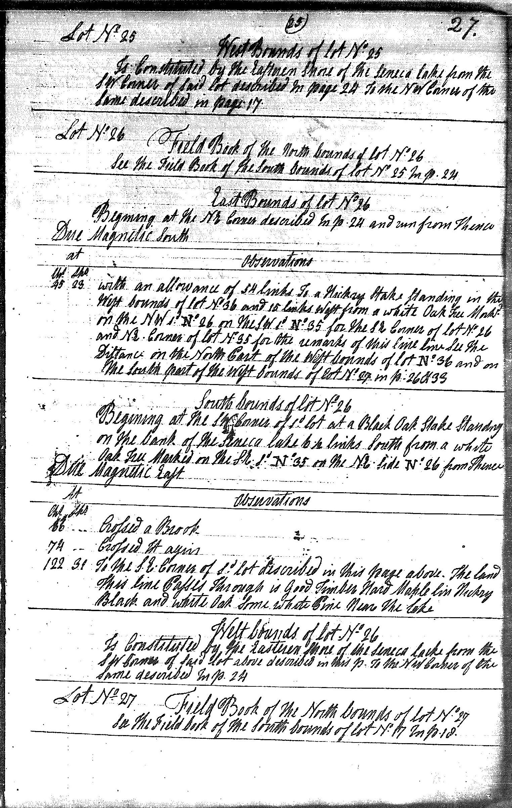

## Lot No. 25

### West Bounds of lot 25

Is Constituted by the Easteren Shore of the Seneca lake from the SW Corner of Said lot described In page 24 [25SW] To the NW Corner of the Same described in page 17 [16SW]

## Lot No. 26

### Field Book of the North bounds of lot No. 26

See the Field Book of the South bounds of lot No. 25 In p. 24

### East Bounds of lot No. 26

Begining at the NE Corner described In p. 24 [25SE] and run from thence Due Magnetic South

| At |    | Observations |
| -- | -- | ------------ |
| Chs | Lks | |
| 45 | 23 | With an allowance of 54 links To a Hickry Stake Standing in the West bounds of lot No. 36 and 15 links West from a white Oak Tree mark’d on the NW s’d No. 26 on the SW s’d No. 35 for the SE Corner of lot No. 26 and N.E. Corner of lot No. 35 for the remarks of this line line See the Distance on the North Part of the West bounds of lot No. 36 and on the South part of the West bounds of lot No. 27 in p. 26 & 33  |

### South bounds lot No. 26

Begining at the SW Corner of S’d lot at a Black Oak Stake Standing on the bank of the Seneca lake 6·/2 links South from a white Oak Tree Marked on the S.E. s’d No. 35 on the N.E. side No. 26 from Thence Due Magnetic East

| At |    | Observations |
| -- | -- | ------------ |
| Chs | Lks | |
| 66 | - | Crossed a Brook |
| 74 | - | Crossed it again |
| 122 | 31 | To the S.E. Corner of S’d lot described in this page above. The land this line Passes Through is Good Timber Hard Maple lin Hickry Black and white Oak Some white Pine Near the lake |

### West bounds of lot No. 26

Is Constituted by the Easteren Shore of the Seneca lake from the SW corner of Said lot above described in this p. [26SW] to the NW corner of the Same described in p. 24 [25SW]

## Lot No. 27

### Field Book of the North bounds of lot No. 27

See the Field book of the South bounds of lot No. 17 In p. 18.

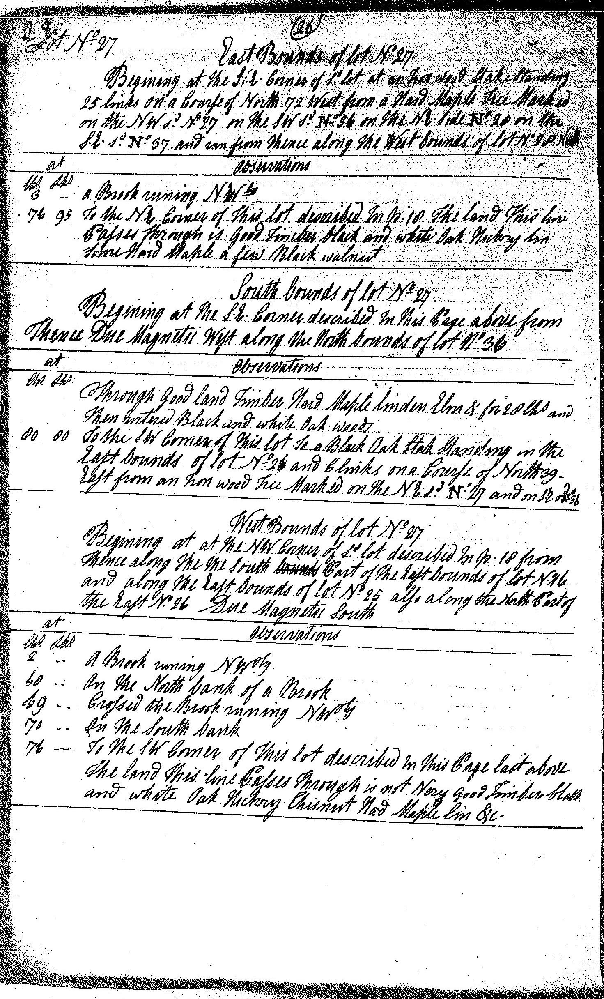

## Lot No. 27

### East Bounds of lot No. 27

Begining at the S.E. Corner of S’d lot at Iron wood Stake Standing 25 links on a Course of North 72 West from a Hard Maple Tree Marked on the NW s’d No. 27 on the SW s’d No. 36 on the N.E. Side No. 28 on the S.E. s’d No. 37 and run from thence along the West bounds of lot No. 28 North

| At |    | Observations |
| -- | -- | ------------ |
| Chs | Lks | |
| 3 | - | A Brook runing N.Wly. |
| 76 | 95 | To the NE Corner of this lot described In p. 18 [pages 17 & 18] [17SE] The land this line Passes through is Good Timber black and white Oak Hickry lin Some Hard Maple a few Black walnut |

### South bounds of lot No. 27

Begining at the S.E. Corner described In this Page above [27SE] from Thence Due Magnetic West along the North bounds of lot No. 36

| At |    | Observations |
| -- | -- | ------------ |
| Chs | Lks | |
| 80 | 80 | Through Good land Timber Hard Maple linden Elm & for 28 lks and then Entered Black and white Oak woods To the SW Corner of this lot to a Black Oak Stak Standing in the East bounds of lot No. 26 and 6 links on a Course of North 39 East from an Iron wood Tree Marked on the NE s’d No. 27 and on S.E s’d No. 36 |

### West Bounds of lot No. 27

Begining at at the NW Corner of S’d lot described In p.18 [17SW] from Thence along the the South bounds Part of the East bounds of lot No. 26 and along the East bounds of lot No. 25 also along the North Part of the East No. 26 Due Magnetic South

| At |    | Observations |
| -- | -- | ------------ |
| Chs | Lks | |
| 2 | - | A Brook runing NWly |
| 68 | - | On the North bank of a Brook |
| 69 | - | Crossed the Brook runing NWly |
| 70 | - | On the South bank |
| 76 | - | To the SW Corner of this lot described In this Page last above [27SW] The land this line Passes through is not Very good Timber black and white Oak Hickry Chisnut Hard Maple lin &c. |

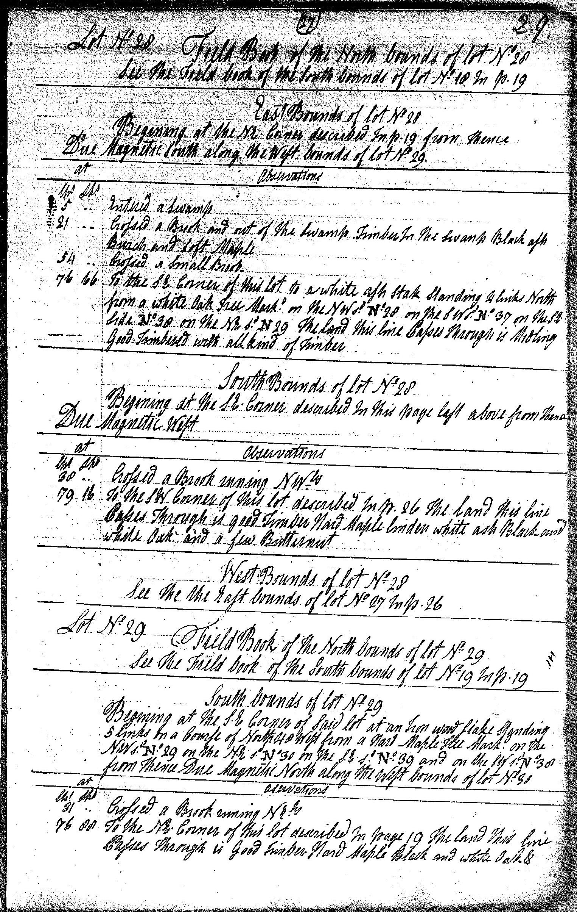

## Lot No. 28

### Field Book of the North bounds of lot No. 28

See the Field book of the South bounds of lot No. 18 In p.19

### East Bounds of lot No. 28

Begining at the N.E. Corner described In p. 19 [page18] [18SE]] from thence Due Magnetic South along the West bounds of lot No. 29

| At |    | Observations |
| -- | -- | ------------ |
| Chs | Lks | |
| 5 | - | Entered a Swamp |
| 21 | - | Crossed a Brook and out of the Swamp Timber In the Swamp Black ash Birch and Soft Maple |
| 54 | - | Crossed a Small Brook |
| 76 | 66 | To the SE Corner of this lot to a white ash Stak Standing 4 links North from a white Oak Tree Mark’d on the NW s’d No. 28 on the SW s’d No. 37 on the S.E. Side No. 38 on the NE s’d No. 29 The land this line Passes through is Midling Good Timbered with all kinds of Timber |

### South Bounds of lot No. 28

Begining at the S.E.Corner described In this page last above [28SE] from thence Due Magnetic West

| At |    | Observations |
| -- | -- | ------------ |
| Chs | Lks | |
| 38 | - | Crossed a Brook runing NWly |
| 79 | 16 | To the SW Corner of this lot described In p. 26 [27SE] The land this line Passes Through is good Timber Hard Maple linden white ash Black and white Oak and a few Butternut |

### West Bounds of lot No. 28

See the the East bounds of lot No. 27 In p. 26

## Lot No. 29

### Field Book of the North bounds of lot No. 29

See the Field book of the South bounds of lot No.19 In p. 19

### South [East] bounds of lot No. 29

Begining at the S.E. Corner of Said lot at an Iron wood Stake Standing 5 links on a Course of North 48 West from a Hard Maple Tree Mark’d on the NW s’d No. 29 on the N.E.s’d No. 30 on the S.E. s’d No. 39 and on the SW s’d No. 38 from thence Due Magnetic North along the West bounds of lot No. 30

| At |    | Observations |
| -- | -- | ------------ |
| Chs | Lks | |
| 31 | - | Crossed a Brook runing NEly |
| 76 | 88 | To the NE Corner of this lot described In page 19 [19SE] The land this line Passes through | is Good Timber Hard Maple Black and white Oak & [&c.] |

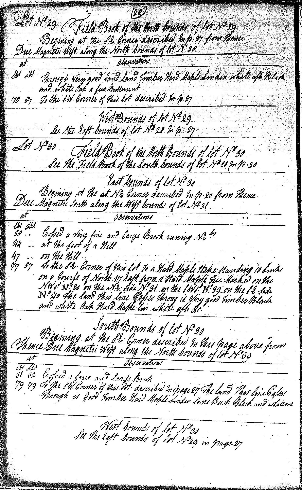

## Lot No. 29

### Field book of the North [South] bounds of lot No. 29

Begining at the SE Corner described In p. 27 [29SE] from thence Due Magnetic West along the North bounds of lot No. 38

| At |    | Observations |
| -- | -- | ------------ |
| Chs | Lks | |
| 78 | 87 | Through Very good land land Timber Hard Maple Linden white ash Black and white Oak a few Butternut To the S.W. Corner of this lot described In p 27 [28SE] |

### West Bounds of lot No. 29

See the East bounds of lot No. 28 In p. 27

## Lot No. 30

### Field Book of the North Bounds of lot No. 30

See the Field Book of the South bounds of lot No. 20 In p. 20

### East bounds of lot No. 30

Begining at the at NE Corner described In p. 20 [20SE] from thence Due Magnetic South along the West bounds of lot No. 31

| At |    | Observations |
| -- | -- | ------------ |
| Chs | Lks | |
| 38 | - | Crossed a Very fine and large Brook runing N.E.ly  |
| 44 | - | At the foot of a Hill |
| 47 | - | On the Hill |
| 77 | 57 | To the S.E. Corner of this lot To a Hard Maple Stake Standing 10 Links on a Course of North 17 East from a Hard Maple Tree Marked on the NW s’d No. 30 on the N.E. side No. 31 on the SW s’d No. 39 on the S.E. Side No. 40 The land this line Passes throug is Very good timber Black and white oak Hard Maple lin white ash &c. |

### South Bounds of lot No. 30

Begining at the S.E. Corner described In this page above [30SE] from thence Due Magnetic West along the North bounds of lot No. 39

| At |    | Observations |
| -- | -- | ------------ |
| Chs | Lks | |
| 31 | 32 | Crossed a fine and large Brook |
| 79 | 79 | To the SW Corner of this lot described In page 27 [29SE] The land this line Passes through is Good Timber Hard Maple Linden Some Beech Black and white oak |

### West bounds of lot No. 30

See the East bounds of lot No. 29 in page 27

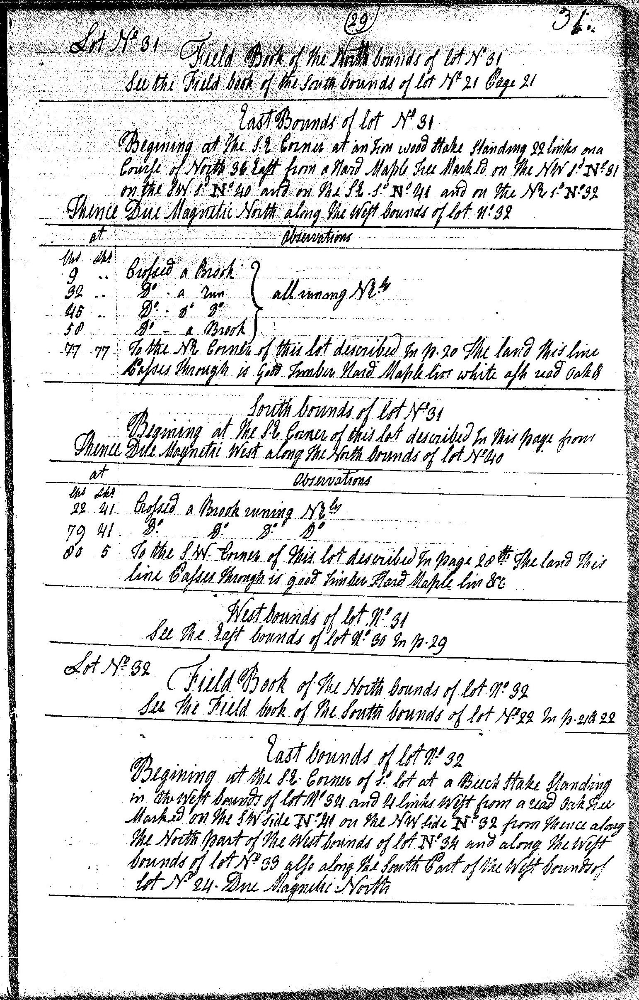

## Lot No. 31

### Field Book of the North bounds of lot No. 31

See the Field book of the South bounds of lot No. 21 Page 21

### East Bounds of lot No. 31

Begining at the S.E. Corner at an Iron wood Stake Standing 22 links on a Course of North 36 East from a Hard Maple Tree Marked on the NW s’d No. 31 on the SW s’d No. 40 and on the SE s’d No. 41 and on the NE s’d No. 32  Thence Due Magnetic North along the West bounds of lot No. 32

| At |    | Observations |
| -- | -- | ------------ |
| Chs | Lks | |
| 9 | - | Crossed a Brook runing NEly |
| 32 | - | D’o [Crossed] a run runing NEly |
| 45 | - | D’o [Crossed a run] runing NEly |
| 58 | - | D’o [Crossed] a Brook runing NEly |
| 77 | 77 | To the NE Corner of this lot described In p. 20 [21SE] The land this line Passes Through is Good Timber Hard Maple lin white ash read oak &[&c.] |

### South bounds of lot No. 31

Begining at the S.E. Corner of this lot described In this page [31SE] from Thence Due Magnetic West along the North bounds of lot No. 40

| At |    | Observations |
| -- | -- | ------------ |
| Chs | Lks | |
| 22 | 41 | Crossed a Brook runing NEly |
| 79 | 41 | D’o [Crossed a Brook runing NEly] |
| 80 | 5 | To the SW Corner of this lot described In page 28th [30SE]. The land this line Passes through is good Timber Hard Maple lin &c. |

### West bounds of lot No. 31

See the East bounds of lot No. 30 In p. 29

## Lot No. 32

### Field Book of the North bounds of lot No. 32

See the Field book of the South bounds of lot No. 22 In p. 21 & 22

### East bounds of lot No. 32

Begining at the S.E. Corner of S’d lot at a Beech Stake Standing in the West bounds of lot No. 34 and 4 links West from a read Oak tree Marked on the SW Side No. 41 on the NW Side No. 32 from thence along the North part of the West bounds of lot No. 34 and along the West bounds of lot No. 33 also along the South Part of the West bounds of lot No. 24. Due Magnetic North

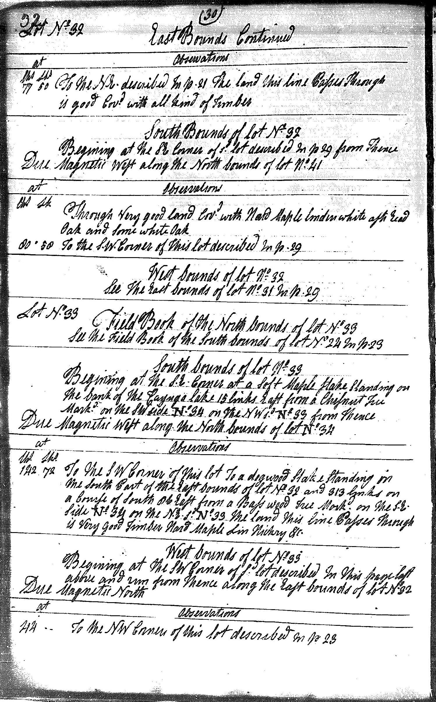

## Lot No. 32

### East Bounds Continued

| At |    | Observations |
| -- | -- | ------------ |
| Chs | Lks | |
| 77 | 50 | To the N.E. described In p. 21 [22SE] The land this line Passes Through is good Cov’d with all kind of Timber |

### South Bounds of lot No. 32

Begining at the SE Corner of S’d lot described In p 29 [32SE] from Thence Due Magnetic West along the North bounds of lot No. 41

| At |    | Observations |
| -- | -- | ------------ |
| Chs | Lks | |
| 80 | 58 | Through Very good land Cov’d with Hard Maple linden white ash Read oak and Some white Oak To the S.W. Corner of this lot described In p. 29 [31SE]  |

### West bounds of lot No. 32

See the East bounds of lot No. 31 In p. 29

## Lot No. 33

### Field Book of the North bounds of lot No. 33

See the Field Book of the South bounds of lot No. 24 In p. 23

### South bounds of lot No. 33

Begining at the S.E. Corner at a Soft Maple Stake Standing on the bank of the Cayuga lake 15 links East from a Chisnut Tree Mark’d on the SW side No. 34 on the NW s’d No. 33 from thence Due Magnetic West along the North bounds of lot No. 34

| At |    | Observations |
| -- | -- | ------------ |
| Chs | Lks | |
| 142 | 72 | To the SW Corner of this lot To a dogwood Stake Standing in the South Part of the East bounds of lot No. 32 and 313 links on a Course of South 86 East from a Bass wood Tree Mark’d on the S.E. Side No. 34 on the N.E. s’d No. 33 The land this line Passes through is very good Timber Hard Maple Lin Hickry &c. |

### West bounds of lot No. 33

Begining at the SW Corner of S’d lot described In this page last above [33SW] and run from thence along the East bounds of lot No. 32 Due Magnetic North

| At |    | Observations |
| -- | -- | ------------ |
| [Chs] | [Lks] | |
| 44 | - | To the NW Corner of this lot described In p 23 [24SW] |

## Lot No. 33

### East Bounds of lot No. 33

Is Constituted by the Westeren Shore of the Cayuga lake from the SE Corner of S’d lot described In page 30 [33 SE] To the NE Corner of the Same described In p. 23 [24SE] (See the Map.)

## Lot No. 34

### Field book of the North bounds of lot No. 34

See the Field book of the South bounds of lot No. 3 [33] In p. 30

### South Bounds of lot No. 34

Begining at the S.E.Corner of Said lot at a Poplar Tree Standing on the Bank of the Cayuga lak and Mark’d on the NW Side No. 34 on the SW s’d No. 42 and run from thence Due Magnetic West along the North bounds of lot No. 42.

| At |    | Observations |
| -- | -- | ------------ |
| Chs | Lks | |
| 45 | - | To the East bank of a Gully |
| 50 | - | On the West bank of the Gully |
| 120 | - | Crossed a Brook |
| 123 | - | Crossed said Brook |
| 153 | 30 | To the S.W. Corner of this lot to a Hard Maple Stake Standing in the North part of the East bounds of lot No. 41 and 33 links West from a white wood Tree Mark’d on the SE Side No. 42 on the N.E. s’d No. 34 The land this line Passes through is good Timber Hard Maple linden Elm white ash Some Black and white Oak & [&c.] |

### West Bounds of lot No. 34

Begining at the S.W. Corner last above described in this page [34SW] and run from thence along the North Part of the East bounds of lot No. 41 and along the South part of the East bounds of lot No. 32 Due Magnetic North

| At |    | Observations |
| -- | -- | ------------ |
| Chs | Lks | |
| 41 | 50 | To the NW Corner of this lot described in p. 30 [33SW] |

### East bounds of lot No. 34

Is Constituted by the Westeren shore of the Cayuga lake from the S.E. Corner of S’d lot described In this p. [34SE] to the N.E. Corner of the Same described In p. 30 [33SE] (See the Map)

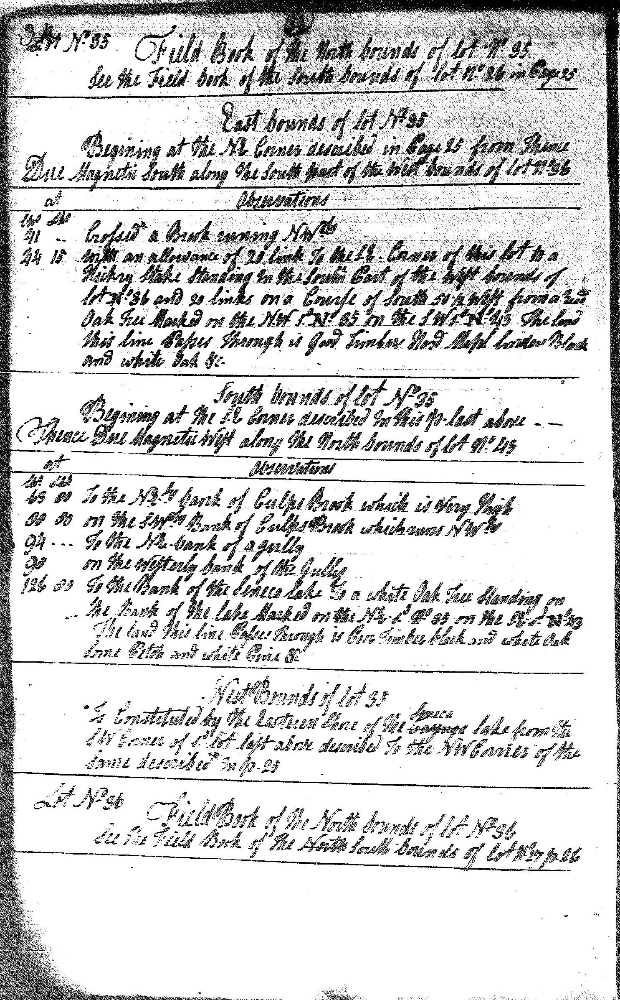

## Lot No. 35

### Field book of the North bounds of lot No. 35

See the Field book of the South bounds of lot No. 26 in Page 25

### East bounds of lot No. 35

Begining at the NE Corner described in Page 25 [26SE] from Thence Due Magnetic South along the South part of the West bounds of lot No. 36

| At |    | Observations |
| -- | -- | ------------ |
| Chs | Lks | |
| 41 | - | Crossed a Brook runing NWly |
| 44 | 15 | With an allowance of 20 link To the S.E. Corner of this lot to a Hickry Stake Standing In the South Part of the West bounds of lot No. 36 and 20 links on a course of South 50·/2 West from a Read Oak Tree Marked on the NW s’d No. 35 on the SW s’d No. 43.  The land this line Passes Through is Good Timber Hard Maple linden Black and white Oak &c |

### South bounds of lot No. 35

Begining at the SE Corner described In This p. last above [35SE] Thence Due Magnetic West along the North bounds of lot No. 43

| At |    | Observations |
| -- | -- | ------------ |
| Chs | Lks | |
| 65 | 80 | To the NEly bank of Culps Brook which is Very High |
| 88 | 80 | On the SWly Bank of Culps Brook which runs NWly  |
| 94 | - | To the NE bank of a gully |
| 98 | - | On the Westerly bank of the Gully |
| 126 | 89 | To the Bank of the Seneca Lake To a white Oak Tree Standing on the Bank of the lake Marked on the NE s’d No. 35 on the SE s’d No. 43 The land this line Passes Through is Poor Timber black and white Oak Some Pitch and white Pine &c |

### West Bounds of lot 35

Is Constituted by the Easteren Shore of the Cayuga Seneca lake from the SW Corner of S’d lot last above described [35SW]To the NW Corner of the Same described In p. 25 [26SW]

## Lot No. 36

### Field Book of the North bounds of lot No. 36

See The Field Book of the North South bounds of lot No. 27 p. 26

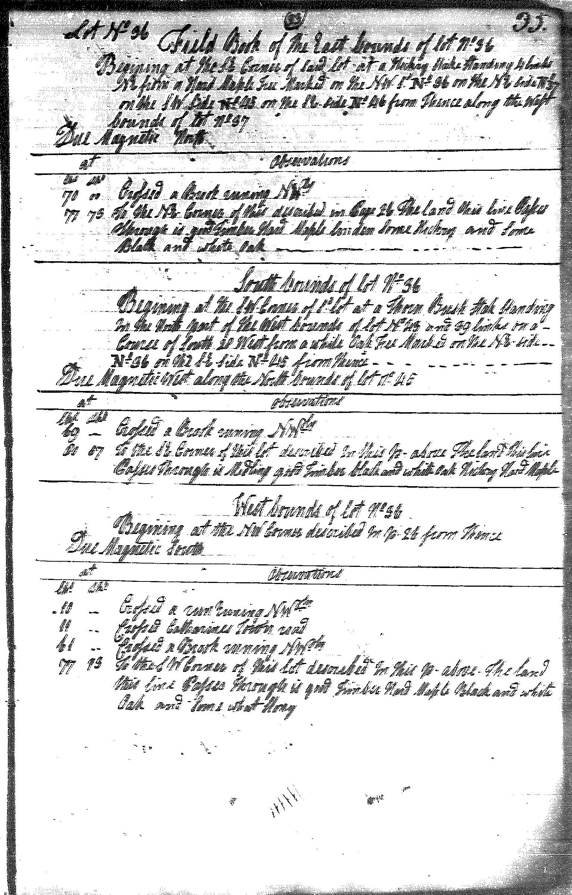

## Lot No. 36

### Field Book of the East bounds of lot No 36

Begining at the SE Corner of Said lot at a Hickry Stake Standing 4 links NE from a Hard Maple Tree Marked on the NW s’d No. 36 on the NE side No. 37 on the SW side No. 45 on the SE side No. 46 from Thence along the West bounds of lot No. 37 Due Magnetic North

| At |    | Observations |
| -- | -- | ------------ |
| Chs | Lks | |
| 70 | - | Crossed a Brook running NWly |
| 77 | 75 | To the NE Corner of this described in Page 26 [27SE] The land this line Passes through is good Timber Hard Maple linden Some Hickory and Some Black and white Oak |

### South bounds of lot No. 36

Begining at the Southwest corner of S’d lot at a Thorn Bush Stak Standing In the North part of the West bounds of lot No. 43 and 39 links on a Course of South 28 West from a white Oak Tree Marked on the NE side No 36 on the SE side No. 45 from Thence Due Magnetic West along the North bounds of lot No. 45

| At |    | Observations |
| -- | -- | ------------ |
| Chs | Lks | |
| 69 | - | Crossed a Brook runing NWly |
| 80 | 67 | To the SE Corner of this lot described In this p. above [36SE] The land this line Passes Through is Midling good Timber black and white Oak Hickry Hard Maple |

### West bounds of lot No. 36

Begining at the NW Corner described In p. 26 [27SW] from Thence Due Magnetic South

| At |    | Observations |
| -- | -- | ------------ |
| Chs | Lks | |
| 10 | - | Crossed a run Runing NWly |
| 11 | - | Crossed Catherines Town road |
| 61 | - | Crossed a Brook running NWly |
| 77 | 13 | To the SW Corner of this lot described In this p. above [36SW]. The land this line Passes Through is good Timber Hard Maple Black and white Oak and Some what Stony |

## Lot No. 37

### Field Book of the North bounds of Lot No. 37

See the Field book of the South bounds of lot No. 28 In page 27

### East bounds of lot No 37

Begining at the NE Corner described In page 27 [28SE] from Thence Due Magnetic South along the West bounds of lot No. 38

| At |    | Observations |
| -- | -- | ------------ |
| Chs | Lks | |
| 49 | - | Crossed a Brook runing NWly  |
| 77 | - | To the SE Corner of this lot Is an Ironwood Stake Standing 15 links on a Course of South 21 West from a Black Oak Tree Marked on the NW side No 37 on the NE s’d No. 38 and on the S.E. side No. 47 and on the SW side No. 46 The land this line Passes Through is Midling good Cov’d with all kind of Timber  |

### South Bounds of lot No. 37

Begining at the SW Corner described In p. 33 [36SE] from Thence Due Magnetic East along the North bounds of lot No. 46

| At |    | Observations |
| -- | -- | ------------ |
| Chs | Lks | |
| 25 | 89 | A Brook runing NEly  |
| 31 | - | Out of Oak woods which distance runs throug oak wood and entered land Cov’d with Hard Maple linden a few Beech Some Black and white Oak |
| 79 | 38 | To the S.E. Corner of this lot described In this p. above [37SE] |

### West bounds of lot No. 37

See the East bounds of lot No. 36 In page 33

## Lot No. 38

### Field book of the North bounds of lot No. 38

See the Field Book of the South bounds of lot No 29 p. 28

### East bounds of lot No. 38

Begining at the SE Corner of S’d lot at a Hard Maple Stake Standing 17 links on a Course of South 15 East from a Hard maple Tree Sapling Mark’d on the NW s’d No. 38 on the N.E.s’d No. 39 on the S.W. side No. 47 on the SE side No. 48 from Thence Due Magnetic North

| At |    | Observations |
| -- | -- | ------------ |
| Chs | Lks | |
| 1 | - | Through land Cov’d with Black and white Oak Then entered Land Cov’d with Hard Maple linden white ash and a few Black and white Oak |
| 22 | - | Entered a Small Black ash Swamp |

## Lot No. 38

### Field Book of the East bounds of lot No. 38 Continued

| At |    | Observations |
| -- | -- | ------------ |
| Chs | Lks | |
| 28 | - | Out of the Swamp |
| 41 | - | Crossed a Brook runing NEly |
| 77 | 71 | To the NE Corner of this lot described in p. 27 [29SE] |

### South Bounds of lot No. 38

Begining at the SW Corner of S’d lot described In p. 34 [37SE] from Thence Due Magnetic East along the North bounds of lot No. 47

| At |    | Observations |
| -- | -- | ------------ |
| Chs | Lks | |
| 33 | - | A Brook |
| 78 | 76 | To the S.E.Corner of this lot described in p. 34 [38SE] The land this line passes Through is good Timbered Hard Maple linden a few Beech Some Black and white Oak |

### West bounds of lot No. 38

See the East bounds of lot 37 In p. 34

## Lot No. 39

### Field Book of the North bounds of lot No. 39

See the Field book of the South bounds of lot No. 31 In p. 28.

### East bounds of lot No. 39

Begining at the NE Corner of S’d lot at described In p. 28 [30SE] from Thence Due Magnetic South along the West bounds of lot No. 40

| At |    | Observations |
| -- | -- | ------------ |
| Chs | Lks | |
| 57 | - | Entered a Black ash Swamp |
| 64 | - | Out of the Swamp |
| 77 | 50 | To the S.E.Corner of this lot To an Iron wood stake standing 30 links on a Course of North 14 East from a Beech Sapling Mark’d on the NW s’d No.39 on the NE  s’d No. 40 on the SW s’d No. 48 on the SE Side No. 49. The land this line Passes through is good cov’d with Black and white Oak Hard Maple linden and white ash |

### South bounds of lot No. 39

Begining at the SW Corner described In p. 34 [38SE] from Thence Due Magnetic East along the North bounds of lot No. 48

| At |    | Observations |
| -- | -- | ------------ |
| Chs | Lks | |
| 44 | 67 | Crossed a Brook runing NEly |
| 58 | 67 | Crossed a Very fine large Brook runing NEly |

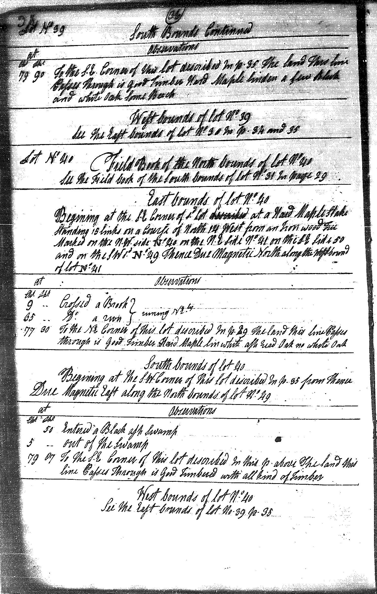

## Lot No. 39

### South Bounds Continued

| At |    | Observations |
| -- | -- | ------------ |
| Chs | Lks | |
| 79 | 90 | To the S.E.Corner of this lot described In p. 35 [39SE] The land this line Passes through is good Timber Hard Maple linden a few Black and white Oak Some Beech |

### West bounds of lot No. 39

See the East bounds of lot No. 38 In p. 34 and 35

## Lot No. 40

### Field Book of the North bounds of lot No. 40

See the Field book of the South bounds of lot No. 31 In page 29

### East bounds of lot No. 40

Begining at the SE Corner of S’d lot described at a Hard Maple Stake Standing 15 links on a Course of North 14 West from an Iron wood Tree Marked on the N.W. side No. 40 on the N.E.Side No. 41 on the SE  Side 50 and on the SW s’d No. 49 Thence Due Magnetic North along the West bounds of lot No. 41

| At |    | Observations |
| -- | -- | ------------ |
| Chs | Lks | |
| 9 | - | Crossed a Brook runing NEly |
| 35 | - | D’o [Crossed]  a run running NEly |
| 77 | 30 | To the NE Corner of this lot described In p. 29 [31SE] The land this line Passes through is good Timber Hard Maple lin white ash Read Oak no white Oak  |

### South bounds of lot 40

Begining at the S.W. Corner of this lot described In p. 35 [39SE] from Thence Due Magnetic East along the North bounds of lot No.49

| At |    | Observations |
| -- | -- | ------------ |
| Chs | Lks | |
| - | 50 | Entered a Black ash Swamp |
| 5 | - | Out of the Swamp |
| 79 | 87 | To the S.E.Corner of this lot described In this p. above [40SE] The land the line Passes through is good Timbered with all kind of Timber |

### West bounds of lot No. 40

See the East bounds of lot No. 39 p. 35

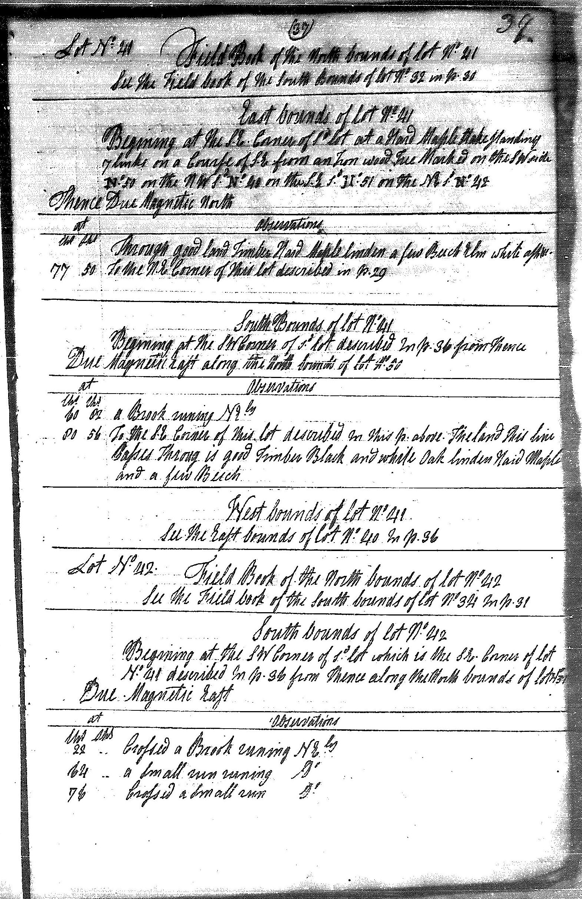

## Lot No. 41

### Field Book of the North bounds of lot No. 41

See the Field book of the South Bounds of lot No. 32 in p. 30

### East bounds of lot No. 41

Begining at the S.E. Corner of S’d lot at a Hard Maple Stake standing 7 Links on a Course of S.E. from an Iron wood Tree Marked on the SW side No. 50 on the NW s’d No. 41 on the SE s’d No. 51 on the NE s’d  No. 42 Thence Due Magnetic North

| At |    | Observations |
| -- | -- | ------------ |
| Chs | Lks | |
| 77 | 50 | Through good land Timber Hard Maple linden a few Beech Elm white ash &c. To the NE Corner of this lot described in p. 29 [32SE] |

### South bounds of lot No. 41

Begining at the SW Corner of S’d lot described In p. 36 [40SE] from thence Due Magnetic East along the North bounds of lot No. 50

| At |    | Observations |
| -- | -- | ------------ |
| Chs | Lks | |
| 60 | 82 | A Brook runing NEly |
| 80 | 56 | To the SE Corner of this lot described In this p. above.[41SE] The land this line Passes throug is good Timber Black and white Oak linden Hard Maple and a few Beech |

### West bounds of lot No. 41

See the East bounds of lot No. 40 In p. 36

## Lot No. 42

### Field Book of the North bounds of lot No. 42

See the Field book of the South bounds of lot No. 34 In p. 31

### South bounds of lot No. 42

Begining at the SW Corner of S’d lot which is the S.E. Corner of lot No. 41 described In p. 36 [41SE] from Thence along the North bounds of lot No. 51 Due Magnetic East

| At |    | Observations |
| -- | -- | ------------ |
| Chs | Lks | |
| 22 | - | Crossed a Brook runing NEly |
| 64 | - | A small run runing D’o [NEly] |
| 76 | - | Crossed a small run D’o [NEly] |

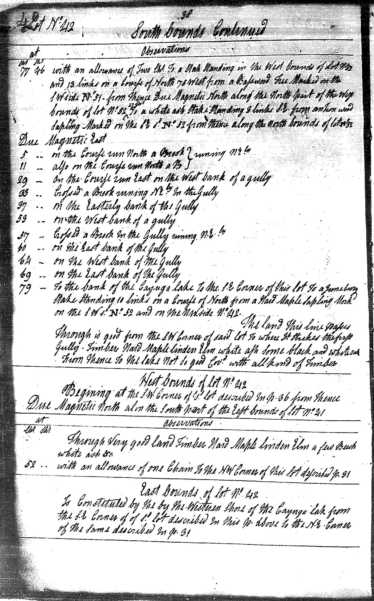

## Lot No. 42

### South bounds Continued

| At |    | Observations |
| -- | -- | ------------ |
| Chs | Lks | |
| 77 | 46 | With an allowance of Two Chs to a Stak Standing in the West bounds of Lot No. 52 and 13 links on a Course of North 75 West from a Basswood Tree Marked on the SW side No. 51 – from Thence Due Magnetic North along the North part of the West bounds of lot No. 52 27 Chs To a white ash Stake Standing 3 links S.E.from an Iron wood Sapling Marked on the SE s’d No. 52 from Thence along the North bounds of lot No. 5 Due Magnetic East |
| 5 | - | On the Course run North a Brook runing NEly |
| 11 | - | Also on the Course run North a B [Brook] runing NEly |
| 29 | - | On the Course run East on the West bank of a gully |
| 33 | - | Crossed a Brook running NEly In the Gully |
| 37 | - | On the Easterly bank of the Gully |
| 53 | - | On the West bank of a gully |
| 57 | - | Crossed a Brook In the Gully runing NEly |
| 60 | - | On the East bank of the Gully |
| 64 | - | On the West bank of the Gully |
| 69 | - | On the East bank of the Gully |
| 79 | - | To the bank of the Cayuga lake To the S.E. Corner of this lot to a June berry Stake Standing 10 links on a Course of North from a Hard Maple Sapling Mark’d on the SW s’d No. 52 and on the N.W. side No. 42. The land this line passes Through is good from the SW Corner of said lot to where It strikes the first Gully – Timber Hard Maple linden Elm white ash Some black and white oak From Thence To the lake Not so good Cov’d with all kind of Timber |

### West bounds of lot No. 42

Begining at the S.W.Corner of S’d lot described In p. 36 [41SE] from Thence Due Magnetic North alon the South part of the East bounds of lot No. 41

| At |    | Observations |
| -- | -- | ------------ |
| Chs | Lks | |
| 52 | - | Through Very good land Timber Hard Maple linden Elm a few Beech white ash &c. With an allowance of one Chain To the NW Corner of this lot described p. 31 [34 SW] |

### East bounds of lot No. 42

Is Constituted by the by the Westeren Shore of the Cayuga lak from the S.E.Corner of of S’d lot described In this p. above To the N.E. Corner of the same described In p. 31 [34SE]

## Lot No. 43

### Field Book of the North bounds of lot No. 43

See the Field Book of the South bounds of lot No. 36 p. 35

### South bounds of lot No. 43

Begining at the SW Corner of S’d lot at a Stake Standing on the Bank of the Seneca lake 15 links West from a June berry Sapling Mark on the NE s’d No. 43 on the SE s’d No. 44 from Thence along the North bounds of lot No. 44 Due Magnetic East

| At |    | Observations |
| -- | -- | ------------ |
| Chs | Lks | |
| 58 | - | Crossed a Brook all runing NWly  |
| 60 | - | D’o [Crossed] a run all runing NWly |
| 98 | - | D’o [Crossed] a Brook all runing NWly |
| 132 | - | To the S.E. Corner of this lot to an Elm Stake Standing in the West bounds of lot No. 45 and 7 links on Course of South 71·° East from a white Oak Sapling Marked on the NW s’d No. 43 on the SW s’d No. 44 The land this line Passes Throug is Poor Timber Black and white Oak Hickry &c. |

### East bounds of lot No. 43

Begining at the N.E. Corner of this lot described In page 32 [35SE] from Thence Due Magnetic South along the South part of the West bounds of lot No. 36 and along the North part of the West bounds of lot No. 45

| At |    | Observations |
| -- | -- | ------------ |
| Chs | Lks | |
| 10 | - | On the South bank of Culps brook |
| 12 | - | Crossed S’d Brook runing NWly |
| 13 | - | On the South bank of Culps Brook |
| 44 | - | To the S.E. Corner of this lot described In this page last above [43SE] The Land this line Passes Through is Midling good Timber hard Maple Black and white Oak Somewhat Stony |

### West bounds of lot No. 43

Is Constituted by the Easterin Shore of the Cayuga Seneca lake from the SW Corner of said lot described in this p. above To the NW Corner of the Same Described In Page 32 [35SW]

## Lot No. 44

### Field Book of the North bounds of lot No. 44

See the Field book of the South bounds of lot No. 43 In this p. above

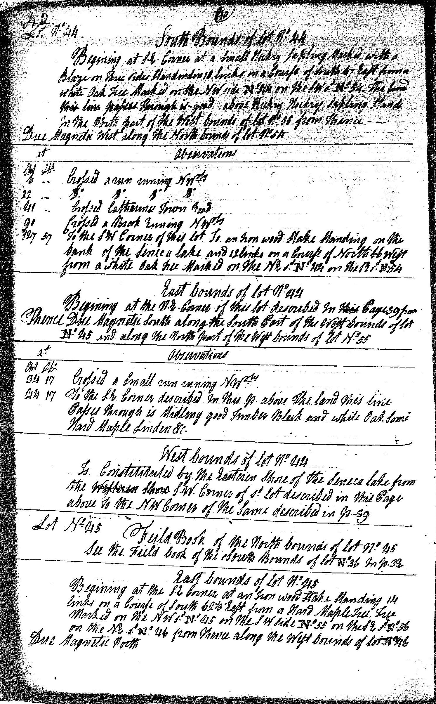

## Lot No. 44

### South Bounds of lot No. 44

Begining at the SE Corner at a Small Hickry Sapling Marked with a Blaze on three sides Standin 10 links on a Course of South 67 East from a White Oak Tree Marked on the NW side No. 44 on the SW s’d No. 54. The land this line Passes through is good above Hickry Hickry Sapling Stands In the North part of the West bounds of lot No. 55 from Thence - Due Magnetic West along the North bounds of lot No. 54

| At |    | Observations |
| -- | -- | ------------ |
| Chs | Lks | |
| 6 | - | Crossed a run runing NWly |
| 22 | - | D’o [Crossed a run runing NWly] |
| 41 | - | Crossed Catherines Town Road |
| 90 | - | Crossed a Brook Runing NWly |
| 137 | 57 | To the SW Corner of this lot To an Iron wood Stake Standing on the bank of the Seneca lake and 12 links on a Course of North 66 West from a white Oak Tree Marked on the NE s’d No. 44 on the SE s’d No. 54 |

### East bounds of lot No. 44

Begining at the N.E. Corner of this lot described In this Page 39 [43SE] from Thence Due Magnetic South along the South Part of the West bounds of lot No. 45 and along the North part of the West bounds of lot No. 55

| At |    | Observations |
| -- | -- | ------------ |
| Chs | Lks | |
| 34 | 17 | Crossed a Small run runing NWly |
| 44 | 17 | To the SE Corner described In this p. above [44SE] The land this line Passes through is Midling good Timber Black and white Oak Some Hard Maple Linden &c. |

### West bounds of lot No.44

Is Constituted by the Easteren Shore of the Seneca lake from the Westeren Shore S.W. Corner of S’d lot described in this Page above [44SW] To the NW Corner of the Same described in p. 39 [43SW]

## Lot No. 45

### Field Book of the North bounds of lot No. 45

See the Field book of the South Bounds of lot No. 36 In p. 33

### East bounds of lot No. 45

Begining at the S.E. Corner at an Iron wood Stake Standing 14 links on a Course of South 62·/ 3 East from a Hard Maple Tree. Tree Marked on the NW s’d No. 45 on the SW side No. 55 on the SE s’d No. 56 on the N.E. s’d  No. 46 from Thence along the West bounds of Lot No. 46 Due Magnetic North

## Lot No. 45

### East bounds of lot No. 45 Continues

| At |    | Observations |
| -- | -- | ------------ |
| Chs | Lks | |
| 10 | - | Crossed a run running NWly |
| 27 | - | D’o [Crossed a run running NWly] |
| 65 | - | Crossed a Brook running NWly |
| 77 | 60 | To the NE Corner of this lot described In this p. 33 [36SE] The Land this line Passes Through is good Timber Hard Maple lin Black and white Oak |

### South Bounds of lot No. 45

Begining at the SE Corner of S’d lot described In p. 40 [45SE] from Thence Due Magnetic West along the North bounds of lot No. 55

| At |    | Observations |
| -- | -- | ------------ |
| Chs | Lks | |
| 4 | - | Crossed a run runing NWly |
| 6 | - | On the Point of a Beech ridge |
| 10 | - | Of the Point |
| 12 | - | On the West bank of Culps Brook and out of land Cov’d with Hard Maple linden lin Beech &c. and entered Poor oak land |
| 80 | 35 | To the SW Corner of this lot to a Black Oak Stak Standing in the South Part of the West bounds of lot No. 44 and 7 links on a Course of South 3·/2 East from a white Oak Sapling Mark’d on the NE s’d No 45 on the SE s’d No. 55 |

### West bounds of lot No. 45

Begining at the NW Corner of this lot described In Page 33 [36SW] from Thence Due Magnetic South along the West bounds of lot No. 43 and along the North part of the West bounds of lot No.44

| At |    | Observations |
| -- | -- | ------------ |
| Chs | Lks | |
| 7 | - | Crossed To the North bank of Culps Brook |
| 9 | - | Crossed S’d  Brook runing NWly |
| 10 | - | On the South bank of S’d Brook |
| 77 | 58 | To the SW Corner of this lot described In this p.above [45SW] the land this line Passes Through is midling good Timber black and white Oak Some Hard Maple and Something Stony |

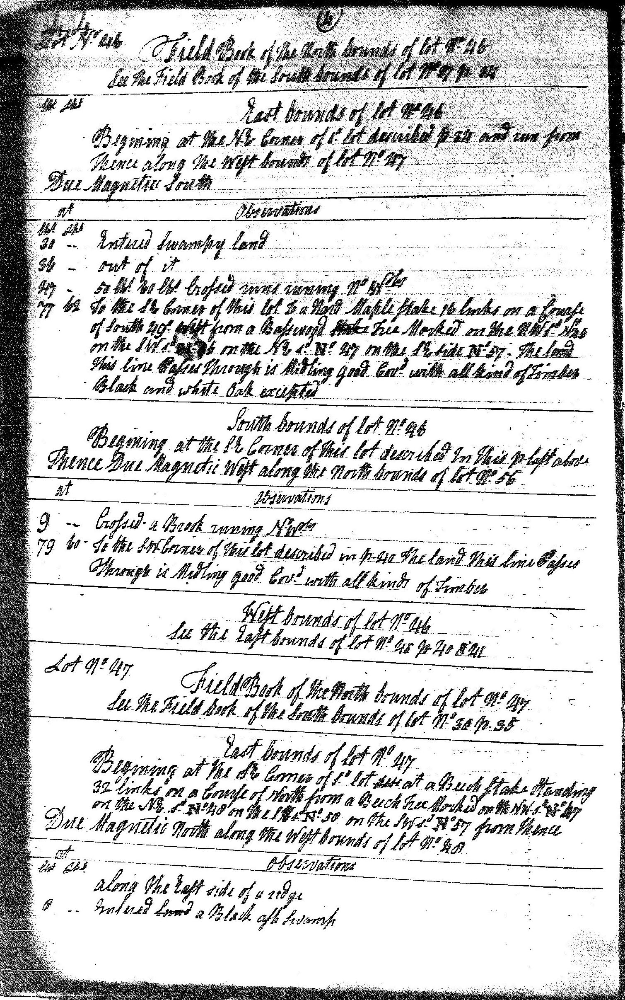

## Lot No. 46

### Field Book of the North bounds of lot No. 46

See the Field Book of the South bounds of lot No. 37 p. 34

### East Bounds of lot No. 46

Begining at the NE Corner of S’d lot described p. 34 [37SE] and run from Thence along the West bounds of lot No. 47 Due Magnetic South

| At |    | Observations |
| -- | -- | ------------ |
| Chs | Lks | |
| 31 | - | Entered Swampy land |
| 36 | - | Out of it |
| 47 | - | 50 Chs 60 Chs Crossed runs running NWly |
| 77 | 62 | To the SE Corner of this lot to a Hard Maple Stake 16 links on a Course of South 49 West from a Basswood Stake Tree Marked on the NW s’d No. 46 on the SW s’d No. 56 on the NE s’d No. 47 on the SE side No. 57. The land this line Passes through is Midling good Cov’d with all kind of Timber Black and white Oak excepted |

### South bounds of lot No. 46

Begining at the SE Corner of this lot described In this p. last above [46SE] Thence Due Magnetic West along the North bounds of lot No. 56

| At |    | Observations |
| -- | -- | ------------ |
| Chs | Lks | |
| 9 | - | Crossed a Brook runing NWly |
| 79 | 60 | To the SW Corner of this lot described in p. 40 [45SE] The land this line Passes Through is | Midling good Cov’d with all kinds of Timber |

### West bounds of lot No. 46

See the East bound of lot No. 45 p. 40 & 41

## Lot No. 47

### Field Book of the North bounds of lot No. 47

See the Field book of the South bounds of lot No. 38 p. 35

### East bounds of lot No. 47

Begining at the SE Corner of S’d lot see at a Beech Stake Standing 32 links on a Course of North from a Beech Tree Marked on the NW s’d No. 47 on the NE s’d No. 48 On the SE s’d No. 58 on the SW s’d No. 57 from thence Due Magnetic North along the West bounds of lot No. 48

| At |    | Observations |
| -- | -- | ------------ |
| Chs | Lks | |
| - | - | Along the East side of a ridge |
| 9 | - | Entered land a Black ash Swamp |

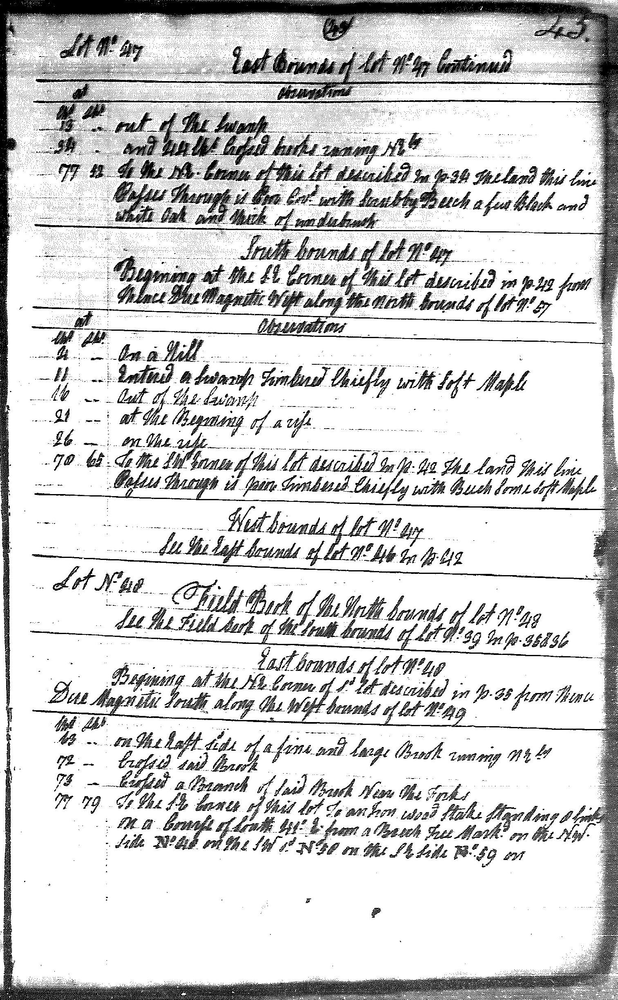

## Lot No. 47

### East Bounds of lot No. 47 Continued

| At |    | Observations |
| -- | -- | ------------ |
| Chs | Lks | |
| 15 | - | Out of the Swamp |
| 34 | - | and 44 Chs Crossed brooks runing NEly |
| 77 | 52 | To the N.E. Corner of this lot described In p. 34 [37SE] The land this line Passes Through is Poor Cov’d with Scrubby Beech a few Black and white Oak and thick of underbrush |

### South bounds of lot No. 47

Begining at the SE Corner of this lot described in p. 42 [47SE] from Thence Due Magnetic West along the North bounds of lot No. 57

| At |    | Observations |
| -- | -- | ------------ |
| Chs | Lks | |
| 4 | - | On a Hill |
| 11 | - | Entered a Swamp Timbered Chiefly with Soft Maple |
| 16 | - | Out of the swamp |
| 21 | - | At the Begining of a rise |
| 26 | - | On the rise |
| 78 | 65 | To the SW Corner of this lot described In p. 42 [46SE] The land this line Passes through is poor Timbered Chiefly with Beech Some Soft Maple |

### West bounds of lot No. 47

See the East bounds of lot No. 46 In p.42

## Lot No. 48

### Field Book of the North bounds of lot No. 48

See the Field book of the South bounds of lot No. 39 In p. 35 & 36

### East bounds of lot No. 48

Begining at the NE Corner of S’d lot described in p. 35 [39SE] from Thence Due Magnetic South along the West bounds of lot No. 49

| [At] |    | [Observations] |
| -- | -- | ------------ |
| Chs | Lks | |
| 63 | - | On the East Side of a fine and large Brook runing NEly |
| 72 | - | Crossed said Brook |
| 73 | - | Crossed a Branch of Said Brook Near the Forks |
| 77 | 79 | To the SE Corner of this lot to an Iron wood Stake Standing 8 links on Course of South 41°E. from a Beech Tree Mark’d on the N.W. Side No. 48 on the SW s’d No 58 on the SE Side No. 59 on |

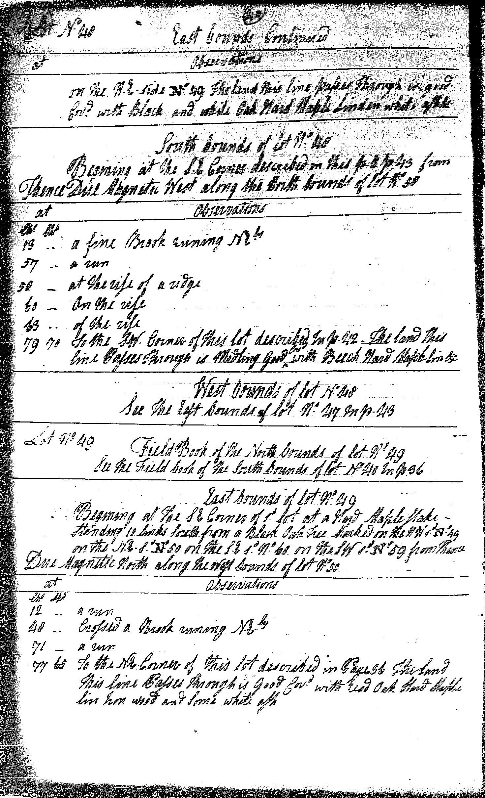

## Lot No. 48

### East Bounds Continued

| At |    | Observations |
| -- | -- | ------------ |
| - | - | on the N.E. side No. 49 The land this line passes through is good Cov’d with Black and white Oak Hard Maple Linden white ash &c. |

### South bounds of lot No. 48

Begining at the SE Corner described in this p.& p. 43 [48SE] from Thence Due Magnetic West along the North bounds of lot No. 58

| At |    | Observations |
| -- | -- | ------------ |
| Chs | Lks | |
| 13 | - | A fine Brook runing NEly |
| 57 | - | A run |
| 58 | - | At the rise of a ridge |
| 60 | - | On the rise |
| 63 | - | Of [Off] the rise |
| 79 | 70 | To the SW Corner of this lot described in p. 42. [47SE] The land this line Passes Through is Midling Good cov’d with Beech Hard Maple lin &c. |

### West bounds of lot No. 48

See the East bounds of lot No. 47 In p.43

## Lot No. 49

### Field Book of the North bounds of lot No. 49

See the Field book of the South bounds of lot No. 40 In p. 36

### East bounds of lot No. 49

Begining at the SE Corner of S’d lot at a Hard Maple Stake Standing 11 links South from a Black Oak Tree Marked on the NW s’d No. 49 on the NE s’d No. 50 on the SE s’d No. 60 on the SW s’d No. 59 from Thence Due Magnetic North along the West bounds of lot No. 50

| At |    | Observations |
| -- | -- | ------------ |
| Chs | Lks | |
| 12 | - | A run |
| 48 | - | Crossed a Brook runing NEly  |
| 71 | - | A run |
| 77 | 65 | To the NE Corner of this lot described in Page 36 [40SE]  The land this line Passes Through is Good Cov’d with Read Oak Hard Maple lin Iron wood and Some white ash |

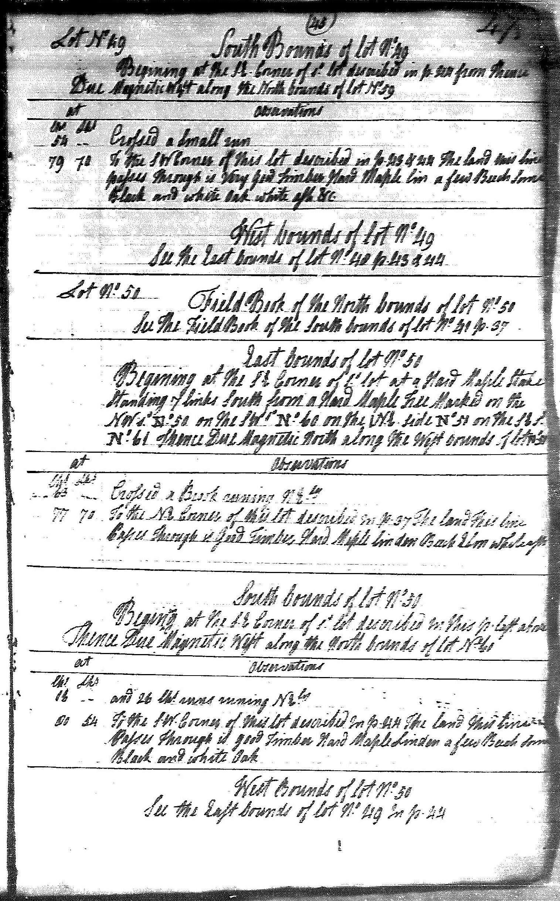

## Lot No. 49

### South Bounds of lot No. 49

Begining at the SE Corner of said lot described in p. 44 [49SE] from Thence Due Magnetic West along the North bounds of lot No. 59

| At |    | Observations |
| -- | -- | ------------ |
| Chs | Lks | |
| 54 | - | Crossed a Small run |
| 79 | 70 | To the SW Corner of this lot described in p. 43 & 44 [48SE] The land this line passes Through is Very Good Timber Hard Maple lin a few Beech Some Black and white Oak white ash &c. |

### West bounds of lot No. 49

See the East bounds of lot No. 48 p. 43 & 44

## Lot No. 50

### Field Book of the North bounds of lot No. 50

See the Field Book of the South bounds of lot No. 41 p. 37

### East Bounds of lot No. 50

Begining at the SE Corner of S’d lot at a Hard Maple Stake Standing 7 links South from a Hard Maple Tree Marked on the NW s’d No. 50 on the SW s’d No. 60 on the NE side No. 51 on the SE s’d No. 61 thence Due Magnetic North along the West bounds of lot No. 51

| At |    | Observations |
| -- | -- | ------------ |
| Chs | Lks | |
| 63 | - | Crossed a brook runing NEly  |
| 77 | 70 | To the NE Corner of this lot described In p. 37 [41SE] The land this line Passes Through is Good Timber Hard Maple linden Beech Elm white ash |

### South bounds of lot No. 50

Begining at the SE Corner of said lot described on this page last above [50SE] Thence Due Magnetic West along the North bounds of lot No. 60

| At |    | Observations |
| -- | -- | ------------ |
| Chs | Lks | |
| 16 | - | And 26 Chs  runs runing NEly |
| 80 | 54 | To the S.W. Corner of this lot described In p. 44 [49SE] The land this line Passes Through is good Timber Hard Maple Linden a few Beech Some Black and white Oak |

### West Bounds of lot No. 50

See the East bounds of lot No. 49 In p.44

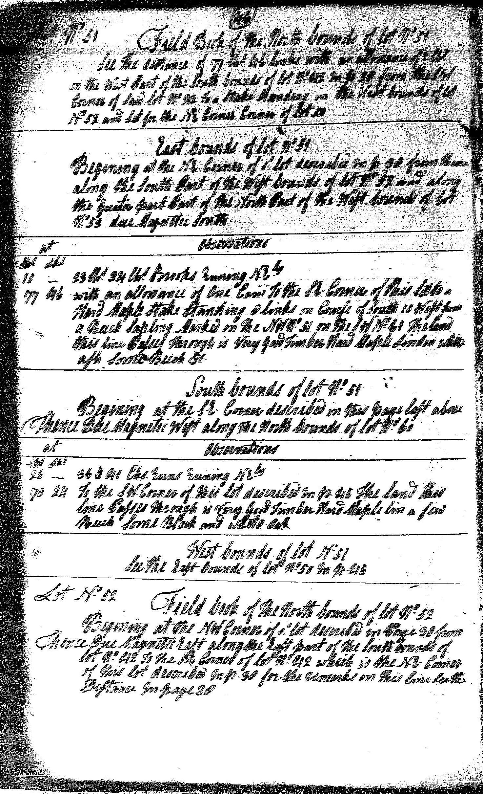

## Lot No. 51

### Field Book of the North bounds of lot No. 51

See the distance of 77 Chs 46 links with an allowance of 2 Chs on the West Part of the South bounds of lot No. 42 In p. 38 from the SW Corner of Said lot No. 42 to a Stake Standing in the West bounds of lot No. 52 and Set for the NE corner of lot 51

### East bounds of lot No. 51

Begining at the NE Corner of said lot described In p. 38 [42 @ 77 Chs 46 lks in desc.]  from thence along the South Part of the West bounds of lot No. 52 and along the greater part Part of the North Part of the West bounds of lot No. 53 due Magnetic South

| At |    | Observations |
| -- | -- | ------------ |
| Chs | Lks | |
| 10 | - | 23 Chs 34 Chs Brooks runing NEly |
| 77 | 46 | with an allowance of One [Can?] To the S.E. Corner of this lot a Hard Maple Stake Standing 8 links on Course of South 10 West from a Beech Sapling Marked on the NW No. 51 on the SW No. 61 The land this line Passes Through is Very Good Timber Hard Maple Linden white ash Some Beech &c. |

### South bounds of lot No. 51

Begining at the SE Corner described in this page last above [51SE] Thence Due Magnetic West along the North bounds of lot No. 61

| At |    | Observations |
| -- | -- | ------------ |
| Chs | Lks | |
| 26 | - | 36 & 41 Chs Runs Runing NEly |
| 70 | 24 | To the SW Corner of this lot described In p. 45 [50SE] The land this line Passes Through is Very Good Timber Hard Maple lin a few Beech Some Black and white Oak |

### West bounds of lot No. 51

See the East bounds of lot No. 50 in p. 45

## Lot No. 52

### Field book of the North bounds of lot No. 52

Begining at the NW Corner of S’d lot described in Page 38 [42  77 Chs 46 lks -in the desc] from Thence Due Magnetic East along the East part of the South bounds of lot No. 42 to the NE Corner of lot No. 42 which is the NE Corner of this lot described In p. 38 [42SE] for the remarks on this line see the Distance In page 38.
