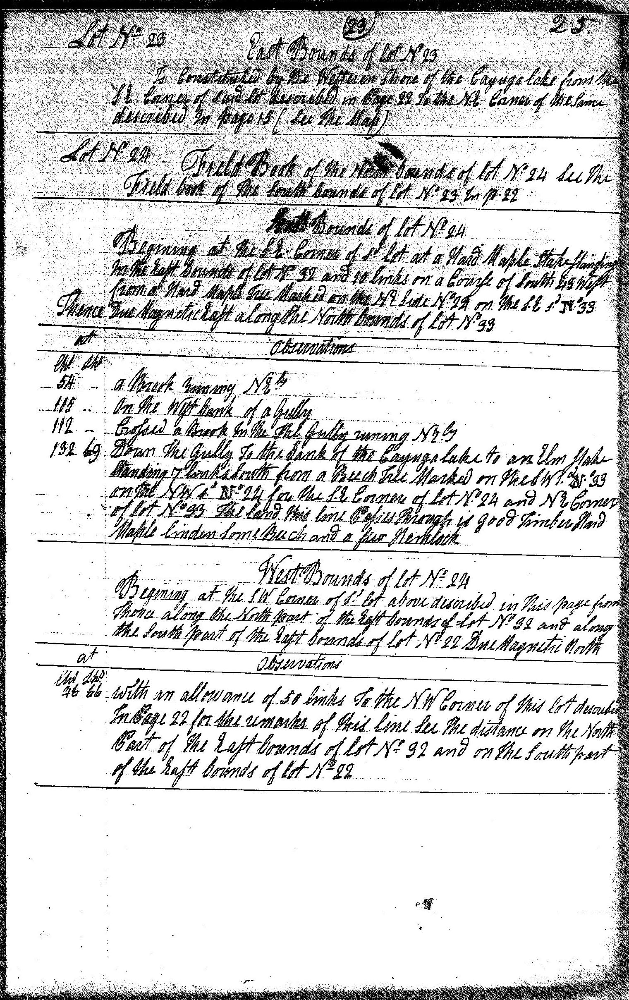

## Lot No. 23

### East Bounds of lot No. 23

Is Constituted by the Westeren Shore of the Cayuga lake from the S.E. Corner of said lot described in Page 22 [23SE] To the N.E. Corner of the Same described in page 15 [14SE] (see the map)

## Lot No. 24
### Field Book of the North bounds of lot No. 24

See the Field book of the South bounds of lot No. 23 In p. 22

### South Bounds of lot No. 24

Begining at the S.E. [SW] Corner of S’d lot at a Hard Maple Stake standing In the East bounds of lot No. 32 and 10 links on a Course of South 43 West from a Hard Maple Tree Marked on the NE Side No. 24 on the S.E. s’d No. 33 Thence Due Magnetic East along the North bounds of lot No. 33

| At |    | Observations |
| -- | -- | ------------ |
| Chs | Lks | |
| 54 | - | A Brook runing NEly |
| 115 | - | On the West bank of a Gully |
| 121 | - | Crossed a Brook In the The Gully runing NEly |
| 132 | 69 | Down the Gully To the bank of the Cayuga lake to an Elm stake Standing 7 links South from a Beech Tree Marked on the SW s’d No. 33 on the NW s’d No. 24 for the S.E. Corner of lot No. 24 and NE Corner of lot No. 33 The land this line Passes through is good Timber Hard Maple linden Some Beech and a few Hemlock |

### West Bounds of lot No. 24

Begining at the SW Corner of S’d lot above described in this page [24SW] from Thence along the North part of the East bounds of lot No. 32 and along the South part of the East bounds of lot No. 22 Due Magnetic North.

| At |    | Observations |
| -- | -- | ------------ |
| Chs | Lks | |
| 46 | 66 | With an allowance of 50 links To the NW Corner of this lot described in Page 22 [23SW] for the remarks of this line See the distance on the North Part of the East bounds of lot No. 32 and on the South part of the East bounds of lot No. 22 |
