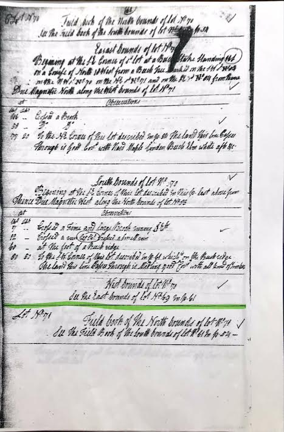

# Lot No. 70

## Field book of the North bounds of lot No. 70
See the Field book of the South bounds of lot No. 60 In p. 54

## East bounds of lot No. 70
Begining at the SE Corner of S’d lot at a Beech Stake Standing 11 links on a Course of North 18 West from a Beech Tree marked on the SW s’d No. 83 on the NW s’d No. 70 on the NE s’d No. 71 and on the SE s’d No. 84 from Thence Due Magnetic North along the West bounds of lot No. 71

| At |    | Observations |
| -- | -- | ------------ |
| Chs | Lks | |
46 | - | Crossed a Brook
58 | - | D’o  [Crossed a Brook]
77 | 20 | To the NE Corner of this lot described In p. 54 [60SE] The land This line Passes Through is Good cov’d with Hard Maple linden Beech Elm white ash &c.

## South bounds of lot No. 70
Begining at the SE Corner of this lot described In This p. last above [70SE] from Thence Due Magnetic West along the North bounds of lot No. 83

| At |    | Observations |
| -- | -- | ------------ |
| Chs | Lks | |
7 | - | Crossed a Fine and large Brook runing SEly
12 | - | Crossed a run 45 Chs Crossed a Small run
60 | - | At the foot of a Beech ridge
80 | 50 | To the S.W. Corner of this lot described In p. 61 [69SE] which is on the Beech ridge The land This line Passes through is Midling good Cov’d with all kind of Timber

## West bounds of lot No. 70
See the East bounds of lot No. 69 In p. 61

# Lot No. 71

## Field book of the North bounds of lot No. 71
See the Field Book of the South bounds of lot No. 61 In p. 54

