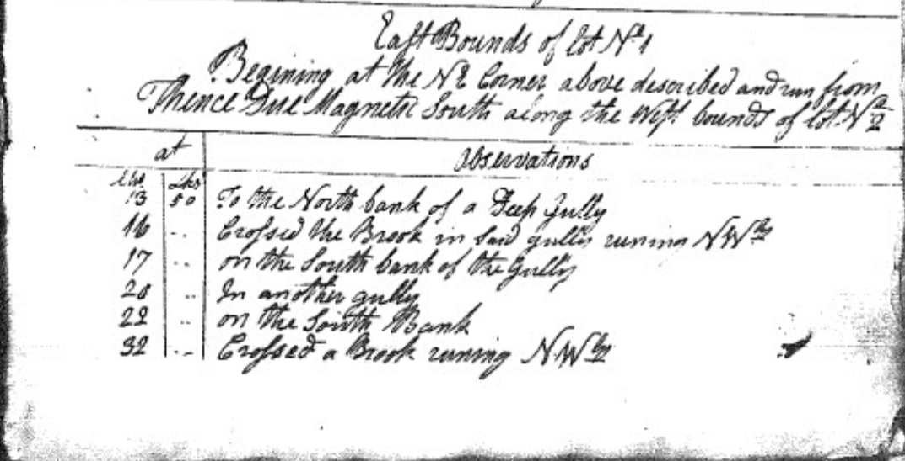

# Transcription guidelines

Text transcription should be literal letter-for-letter transcription, using the original spelling and capitalization:

```
a Brook runing NWly
```

Use square brackets around any added text expansion/explanation/correction.

```
and open woods Timber as Said befor [Black and white Oak]
```

In general, don't correct original spelling errors.  If the original spelling is particularly confusing, add the correct spelling in square brackets.  Common abbreviations will be included in the [glossary](glossary).

Don't add clarifying notes if you are not sure.  (Or possibly add a question mark to indicate uncertainty.)

(example?)

If there is an incorrect page reference, provide the correction in brackets:

```
as previously described on page 27 [page 29]
```

Text that has been crossed out can be notated with double tildes before and after the text that has been struck out:
```
a Stake Standing four links ~~West~~ East from a Black Oak Tree
```

On the website, this will be rendered as:
> a Stake Standing four links ~~West~~ East from a Black Oak Tree

In the transcript, sections that should be converted to additional observation rows in the data table can be highlighted using a blue text color.  These additional rows will only exist in the data table, not the transcription.

(example?)

References to corners should be encoded as follows:
```
To the SE Corner of this lot describe in this page last above [37SE]
```

## Transcription example

Here is an example, showing the original manuscript, the text transcription, and the corresponding observations in the data table.



```
East Bounds of lot No. 1
Begining at the NE Corner above described [1NE] and run
from Thence Due Magnetic South along the West bounds of lot No. 2

at          Observations
Chs  Lks
13    50    To the North bank of a Deep Gully
16     -    Crossed the Brook in Said gully runing NWly
17     -    on the South bank of the Gully
20     -    In another gully
22     -    on the South Bank
32     -    Crossed a Brook runing NWly
```

| Page | Township | Lot No | Bounds | Starting Corner | Direction | Chains | Links | Observation | Transcriber | Transcriber Notes |
| - | - | - | - | - | - | - | - | - | - | - |
| 1 | Ovid | 1 | E | NE | S | 0 | 0 | East Bounds of lot No. 1<br>Begining at the NE Corner above described [1NE] and run<br>from Thence Due Magnetic South along the West bounds of lot No. 2 | ABC |  |
| 1 | Ovid | 1 | E | NE | S | 13 | 50 | To the North bank of a Deep Gully | ABC |  |
| 1 | Ovid | 1 | E | NE | S | 16 | 0 | Crossed the Brook in Said gully runing NWly  | ABC |  |
| 1 | Ovid | 1 | E | NE | S | 17 | 0 | on the South bank of the Gully | ABC |  |
| 1 | Ovid | 1 | E | NE | S | 20 | 0 | In another gully | ABC |  |
| 1 | Ovid | 1 | E | NE | S | 22 | 0 | on the South Bank | ABC |  |
| 1 | Ovid | 1 | E | NE | S | 32 | 0 | Crossed a Brook runing NWly | ABC |  |

[View the spreadsheet template in Google Sheets](https://docs.google.com/spreadsheets/d/1EgKqoj5LNcPy6jUzQmSHUK6TZFkbtIVtuIfe0ViRnZ0/edit?usp=sharing)

[Download the spreadsheet template as an Excel file](https://docs.google.com/spreadsheets/u/0/d/1EgKqoj5LNcPy6jUzQmSHUK6TZFkbtIVtuIfe0ViRnZ0/export?format=xlsx&id=1EgKqoj5LNcPy6jUzQmSHUK6TZFkbtIVtuIfe0ViRnZ0)
